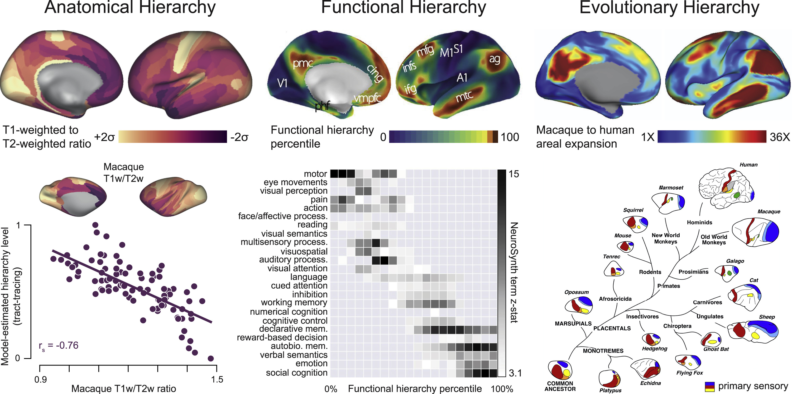
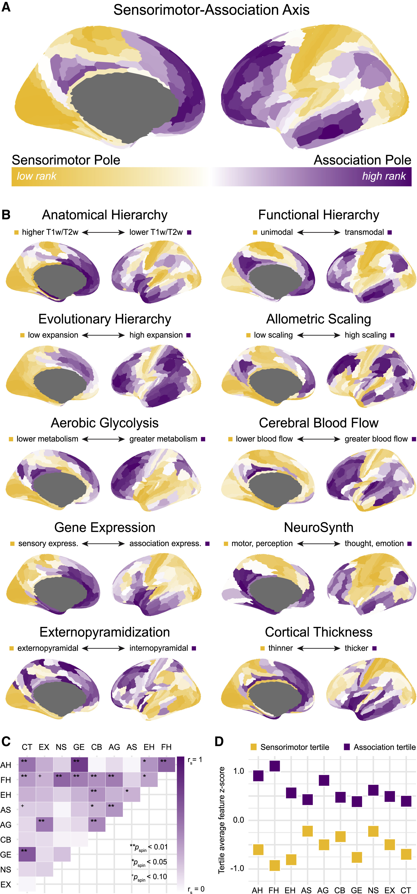
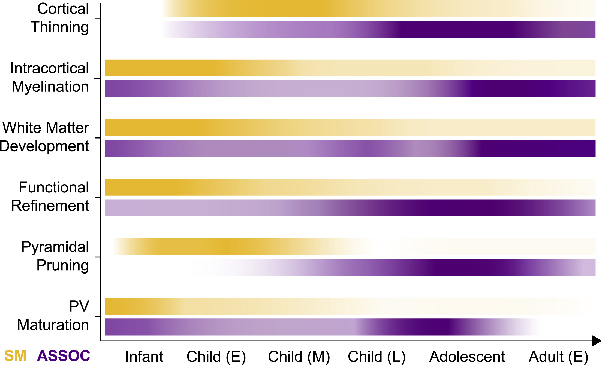
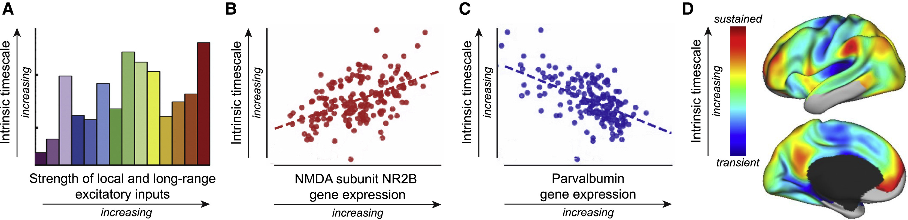
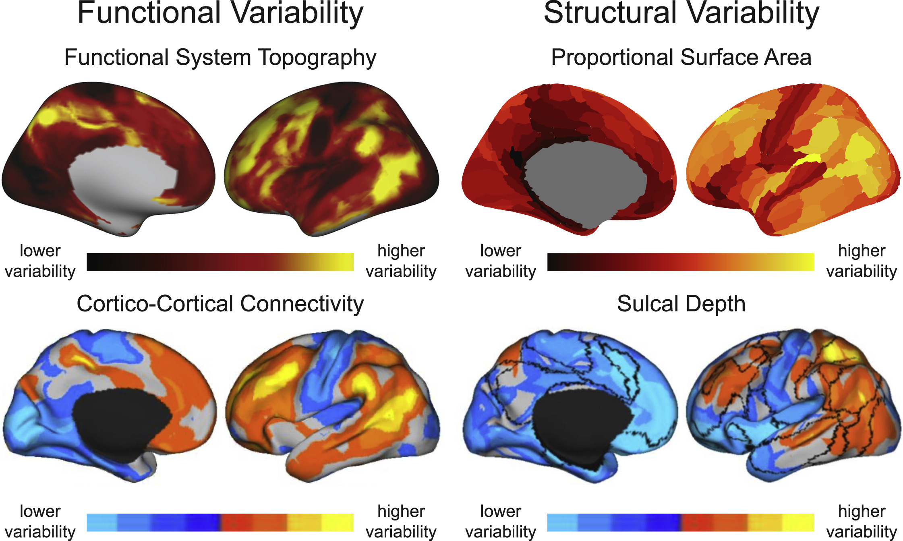
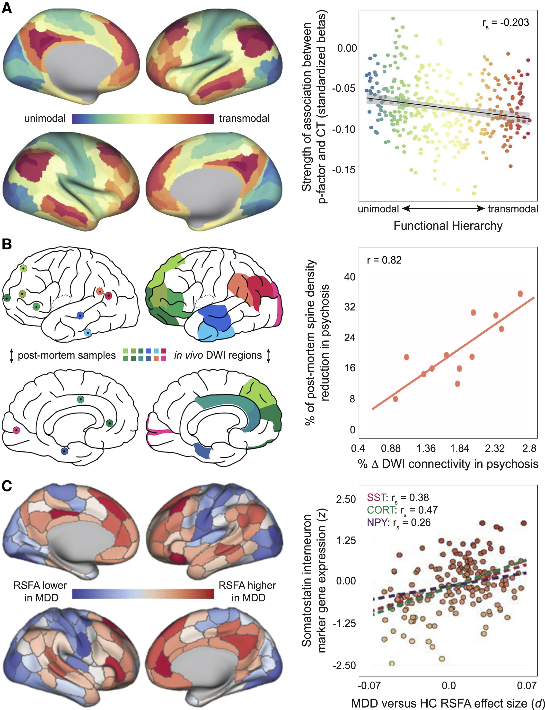

- [Neurodevelopment of the association cortices: Patterns, mechanisms, and implications for psychopathology - ScienceDirect](https://www.sciencedirect.com/science/article/pii/S0896627321004578)
-
- ### Citation
	- 综述
		- [-# Large-Scale Gradients In Human Cortical Organization - 2018 - 218](https://www.remnote.com/doc/eF4ZmeFuSeQbwiHnL?isPin=false)
		- [+# ‘Hierarchy’ In The Organization Of Brain Networks  - 2020 - 63](https://www.remnote.com/doc/LDYN5f6P6BhRCcd95?isPin=false)
		- [-# An Architectonic Type Principle Integrates Macroscopic Cortico-cortical Connections With Intrinsic Cortical Circuits Of The Primate Brain  - 2019 - 26](https://www.remnote.com/doc/0TkmTkRMFMYk4lAyF?isPin=false) - 连接规则对大尺度模型的应用 -*
		- [-# The Structural Model: A Theory Linking Connections, Plasticity, Pathology, Development And Evolution Of The Cerebral Cortex  - 2019 - 60](https://www.remnote.com/doc/RjOd4GuZxSKjWdqYn?isPin=false)  - 结构模型
		- [-# A Tutorial And Tool For Exploring Feature Similarity Gradients With MRI Data  - 2020 - 7](https://www.remnote.com/doc/c9EEZFLAKdSq6puaM?isPin=false)  - 梯度计算教学
	- 疾病
		-
	- 皮层梯度
		- [-# Modes Of Operation: A Topographic Neural Gradient Supporting Stimulus Dependent And Independent Cognition  - 2019 - 41](https://www.remnote.com/doc/juehq2pDUEjrN594s?isPin=false)  - 任务态刺激依赖的层次结构
		- [-# Hierarchy Of Transcriptomic Specialization Across Human Cortex Captured By Structural Neuroimaging Topography - 2018 - 145](https://www.remnote.com/doc/kCAarxRDapXYm5h2C?isPin=false) - T1/T2层次
		- [Not All Cortical Expansions Are The Same: The Coevolution Of The Neocortex And The Dorsal Thalamus In Mammals  - 2018 - 13](https://www.remnote.com/doc/ZaRKnYQgrNvbmVCg9?isPin=false) - 皮层扩展的进化梯度
		- [Cross-species Functional Alignment Reveals Evolutionary Hierarchy Within The Connectome  - 2020 - 37](https://www.remnote.com/doc/3gUHlLJVCx6rsyCJC?isPin=false) - 跨物种的功能梯度
		- [-* Multiscale Communication In Cortico-cortical Networks  - 2021 - 10](https://www.remnote.com/doc/0xXL4l0jNskLCDRZN?isPin=false) - 皮层连接的梯度
		- [-# Gradients Of Connectivity Distance Are Anchored In Primary Cortex  - 2016 - 20](https://www.remnote.com/doc/VMC0OrCdVDCLtrI0s?isPin=false) - 连接距离的梯度
		- [-# Situating The Default-mode Network Along A Principal Gradient Of Macroscale Cortical Organization - 2016 - 511](https://www.remnote.com/doc/3xgeX4jBLuDqQJHsR?isPin=false) - 功能连接网络梯度
		- [A Cortical Hierarchy Of Localized And Distributed Processes Revealed Via Dissociation Of Task Activations, Connectivity Changes, And Intrinsic Timescales  - 2020 - 33](https://www.remnote.com/doc/v2K0Opy2Ful8Am30Y?isPin=false) - 任务态激活与FC的梯度
		- [-* Hierarchical Dynamics As A Macroscopic Organizing Principle Of The Human Brain - 2020 - 22](https://www.remnote.com/doc/vf8yr5DtSDcruRbwL?isPin=false) - 内在时间尺度梯度，皮层下梯度，Hierarchical dynamics
		- [-* Development Of Structure–function Coupling In Human Brain Networks During Youth  - 2019 - 76](https://www.remnote.com/doc/JU8dPbfhWVCGbbJdi?isPin=false) - 结构-功能耦合的梯度
		- [-# Decoupling Of Brain Function From Structure Reveals Regional Behavioral Specialization In Humans  - 2019 - 58](https://www.remnote.com/doc/8VdgQDBC1rXnDmraJ?isPin=false) - 结构-功能耦合的梯度
		- [-# Neuron Density Fundamentally Relates To Architecture And Connectivity Of The Primate Cerebral Cortex  - 2019 - 16](https://www.remnote.com/doc/y4UdnCizfJCrEt5nZ?isPin=false) - 神经元密度梯度，与结构连接的关联
		- [-* The Natural Axis Of Transmitter Receptor Distribution In The Human Cerebral Cortex - 2021 - 9](https://www.remnote.com/doc/N22325heSJ74cohHf?isPin=false) - 神经递质受体梯度
		- [Gradients Of Functional Connectivity In The Mouse Cortex Reflect Neocortical Evolution  - 2021 - 12](https://www.remnote.com/doc/0VlrnlujZXmqETKjt?isPin=false) - 小鼠功能梯度
		- [Mapping Gene Transcription And Neurocognition Across Human Neocortex  - 2021 - 14](https://www.remnote.com/doc/Rq25kUTv05Uhv5Rj6?isPin=false)  - 腹内侧-背外侧 基因表达-认知结构 梯度
		- [-# Microstructural And Functional Gradients Are Increasingly Dissociated In Transmodal Cortices  - 2019 - 184](https://www.remnote.com/doc/j1ZFGPqJx29ZfKP9r?isPin=false) - 微结构梯度与功能梯度在联合皮层解耦
		- [Shifts In Myeloarchitecture Characterise Adolescent Development Of Cortical Gradients  - 2019 - 33](https://www.remnote.com/doc/jI5BIafFezYCpUt0f?isPin=false) - 深度依赖性髓鞘梯度成熟
		- [-# Transcriptional And Imaging-genetic Association Of Cortical Interneurons, Brain Function, And Schizophrenia Risk  - 2020 - 29](https://www.remnote.com/doc/IsotpVTsPq9qWKeX1?isPin=false) - 中间神经元与小白蛋白基因的空间异质性
	- 联合皮层
		- [-# Functional Specialization And Flexibility In Human Association Cortex  - 2015 - 306](https://www.remnote.com/doc/6x79056Bso8Xw5xy2?isPin=false)
		- [Quantitative Assessment Of Prefrontal Cortex In Humans Relative To Nonhuman Primates  - 2017 - 91](https://www.remnote.com/doc/vBKGlWUFm3FkMNdmY?isPin=false)
		- [Genetic Mapping And Evolutionary Analysis Of Human-expanded Cognitive Networks  - 2019 - 39](https://www.remnote.com/doc/u6yjeR1m92SanrofD?isPin=false)
-
- ## Summary
	- 人类大脑经历了一个跨越数十年的长期皮层发育期。
	- 在儿童和青少年期间，皮层发育从具有感觉和运动功能的低阶，初级和单模式皮层进展到高阶，跨模式联合皮层，服务于执行，社会情绪和心理功能。因此，皮层成熟的时空模式以分层的方式进行，符合皮层组织的进化根源，感觉运动-联想轴。
	- 这个发展计划由来源于多模式人类神经影像学的数据所描述，并与可塑性相关神经生物学事件的层次展开有关。重要的是，这个发育程序用于增强低阶和高阶区域之间的特征变异，从而赋予大脑联合皮层独特的功能特性。
	- 然而，越来越多的证据表明，作为人类发育计划拥有属性的晚熟关联皮层的长期可塑性，也赋予了不同发育精神病理学的风险。
-
- ## Introduction
	- 人类大脑支持独特的认知、社会情感和心智能力。这些能力作为最近进化发展的一部分而出现，并通过神经发育过程在每个个体中塑造和增强。这种人类特有的能力是由大脑的联合皮层所支配的: 在整个儿童和青少年时期，系统发育较新的表现出持久的神经发育的皮层区域。联合皮层的成熟部分地支持了在生命的头几十年中观察到的显着的智力，情感和行为变化，成熟的变异性导致执行和心理社会功能的个体间差异。
	- 大脑的联合皮层——由前额叶、扣带回、下顶叶、楔前叶和颞叶中部区域组成，通常统称为“联合皮层”——是皮层的扩张和整合区域，主要可以与初级感觉和运动皮层进行对比。初级感觉运动区(即初级视觉，听觉，躯体感觉和运动皮层)是单峰的，功能特异性的，并涉及感觉，知觉和行动的过程。相比之下，关联皮层的区域往往是多模态或跨模态的(尽管存在单模态关联区域) ，功能灵活，并被招募用于信息整合，感知解耦认知或内部思维（[Modes of operation: A topographic neural gradient supporting stimulus dependent and independent cognition - ScienceDirect](https://www.sciencedirect.com/science/article/pii/S1053811918320792?isPin=false)；[Functional Specialization and Flexibility in Human Association Cortex | Cerebral Cortex | Oxford Academic](https://academic.oup.com/cercor/article/25/10/3654/389582?isPin=false)）。 此外，初级区域距离来自支持高阶心理，社会和执行功能的跨模态关联区域最远，单模态和多模态皮层占据空间中间位置 （[Large-Scale Gradients in Human Cortical Organization - ScienceDirect](https://www.sciencedirect.com/science/article/pii/S1364661317302401?isPin=false)）。皮层的这种依赖于距离的布局最终对应于大规模的皮层特征组织轴ーー这个轴在检查整个皮层不同特征的空间变化时反复显示，并通知我们对皮层发育的时间和后果的理解。
	- 轴是皮层区域的一维排序，通过量化一个或多个皮层特性的变异模式来确定。沿着一条轴线占据附近位置的皮层区域ーー不管它们与皮层之间的距离如何ーー对于给定的性质来说是相似的，而那些定义一条轴线的两端的皮层区域分歧是最大的。当通过皮层表面可视化时，组织轴提供了对皮层特性的全局安排和区域间相似程度的洞察，增强了从局部特性角色塑造中得到的信息。关键的是，==为多种不同的皮层特性描绘组织轴的努力已经揭示了组织的主轴通常跨越从初级和单模态感觉和运动皮层，到多模式皮层，最后到支持高级心理功能的跨模式联合皮层，定义了“感觉运动联合(S-A)皮层轴==来自显着不同数据类型的皮层特征，包括
		- 非侵入性神经影像学(Burt 等，2018; Huntenburg 等，2018; Margulies 等，2016; Paquola 等，2019a; Raut 等，2020)
		- 组织学(Beul 和 Hilgetag，2019; Paquola 等，2019a; Scholtens 等，2014)
		- 转录组学(Burt 等，2018; Hansen 等，2021; Krienen 等，2016)
		- 受体放射自显影(Froudist-Walsh 等，2021; Goulas 等，2021)
		- 电生理学(Gao 等，2020; Honey 等，2012; Murray 等，2014)符合这个主要的 S-A 轴。
	- 因此，在许多神经生物学特征中观察到的联合空间变异反映了皮层功能的等级轴，其从低级感觉运动转变为高级联想功能: 从行动到认知，从感知到内省，从感觉到自我意识。
	- 在这篇综述中，我们讨论了整个儿童和青少年时期皮质成熟的时空模式如何沿着 S-A 轴进行，并描述了这种发育序列如何系统地增强皮层的功能变异。
		- 为此，我们首先从跨尺度和物种的分析中综合数据，这些分析揭示了皮层组织的一个统一的、主要的感觉运动-联想轴。这个轴优雅地捕捉了已知的皮层解剖学，生理学，基因表达和功能的多样性，并提供了一个框架来理解皮层发育的进展和生物行为结果。
		- 我们接下来回顾了利用人类先进的体内神经影像学研究的相关证据，这些研究已经开始描述从儿童早期到成年期的皮质成熟的展开。具体来说，我们强调结构，弥散，功能和化学神经影像的工作中已记录的跨感觉运动和联合皮层的差异成熟模式。
		- 我们进一步探索神经影像学，组织学，生理学和转录组学在大脑发育中的发现之间的关系，努力将大尺度时空发育模式与涉及皮层可塑性的微尺度机制联系起来。
		- 最后，我们考虑个体间成熟变异的主要原因和后果。
	- 综上所述，现有的文献支持一个人类大脑发育的模型，其中==成熟发生在一个占主导地位的等级组织轴上==。
		- 在这个发育项目中，跨模式联合皮层比感觉运动皮层发育时间更长，通过婴儿期，儿童期和青少年期表现出持续的发育相关变化，并在发育中完成相对较晚的成熟过程。
		- 这个发展程序是至关重要的，塑造许多结构、功能和计算特性，区分跨模式联想皮层从其余的皮层景观。
		- 然而，高级联想皮层(大脑发育程序的拥有属性)的长期可塑性使得这些皮层区域特别容易受到发育性干扰影响，并使人类面临发育性精神病理学的风险。
-
- ## Hierarchical cortical topography and the sensorimotor-association axis
	- ### A hierarchical axis of cortical organization
		- 神经科学的一个中心目标是理解皮层组织和拓扑的内在模式(即，皮层区域的空间分布)以及与皮层功能的关系。 数十年来致力于这一目标的研究揭示了解剖学和功能组织的模式如何被理解为符合大规模的皮层等级制度，由皮层区域的有序排名定义（[‘Hierarchy’ in the organization of brain networks | Philosophical Transactions of the Royal Society B: Biological Sciences](https://royalsocietypublishing.org/doi/full/10.1098/rstb.2019.0319?isPin=false)）。
		- ==研究已经确定了三个这样的皮层等级的重要性ーー这些等级由皮层解剖学、皮层功能和皮层进化来描述==。
			- 皮层解剖学的基础研究检查了结构分化和皮层-皮层连接的层状起源，有助于确定主要的皮层等级(Barbas，1986; Felleman 和 Van Essen，1991)。在这个解剖学定义的皮质层次结构中，层次结构中最低的区域是那些具有高神经元密度和更大比例的参与前馈通信的颅上起源连接的区域（[An architectonic type principle integrates macroscopic cortico-cortical connections with intrinsic cortical circuits of the primate brain | Network Neuroscience | MIT Press](https://direct.mit.edu/netn/article/3/4/905/95790/An-architectonic-type-principle-integrates?isPin=false)；[The Structural Model: a theory linking connections, plasticity, pathology, development and evolution of the cerebral cortex | SpringerLink](https://link.springer.com/article/10.1007/s00429-019-01841-9?isPin=false)）。
			- 在功能服从结构的理论的基础上，提出了解剖层次将促进层次信息处理从涉及外向感知的较低层次区域向涉及内部聚焦认知过程的较高层次区域进行(Mesulam，1998)。大量跨物种的研究ーー使用多种技术，如体内神经记录、病变映射、神经调节和基于任务的功能性磁共振成像ーー证实了一个区域在解剖学上定义的等级中的位置与其功能之间的关系。 现在很明显，解剖层次结构中最低的皮层区域映射到感觉和运动区域，而层次结构中高层的皮层区域是联合皮层，能够整合，感知解耦和抽象的心理功能。换句话说，解剖学定义的层次结构在空间上与从低级到高级的功能性皮层层次结构相结合，其中在人类中进展最大的功能占据了该层次结构的顶点（[Hierarchy of transcriptomic specialization across human cortex captured by structural neuroimaging topography | Nature Neuroscience](https://www.nature.com/articles/s41593-018-0195-0?isPin=false)）。
			- 值得注意的是，这些解剖学和功能层次映射到第三个，基于进化的皮层层次。在哺乳动物进化树中，人类和其他物种之间的皮层扩张模式是进化层次的索引。低阶感觉和运动皮层区域在最早的哺乳动物(即那些在进化树中处于最低位的动物)中存在并且在皮层中占优势。在随后的许多哺乳动物物种中，感觉脑区经历了额外的功能特化，伴随着感觉皮层扩大或皮层放大(Krubitzer，2007)。然而，在灵长类动物谱系中，致力于感觉和运动区域的皮层表面的比例下降，而系统发育新的关联皮层占据的比例显着增加(Buckner 和 Krienen，2013; Halley 和 Krubitzer，2019; Krubitzer，2007; Krubitzer 和 Kahn，2003 [Not all cortical expansions are the same: the coevolution of the neocortex and the dorsal thalamus in mammals - ScienceDirect](https://www.sciencedirect.com/science/article/pii/S0959438818302010?isPin=false) )。特别是人类，具有比猕猴和黑猩猩的额叶、颞叶和顶叶关联皮层更扩张的皮层，并且比单独的大脑尺寸增加所预期的要扩张得多([Just a moment...](https://www.pnas.org/doi/abs/10.1073/pnas.1721653115?isPin=false)；[Cross-species functional alignment reveals evolutionary hierarchy within the connectome - ScienceDirect](https://www.sciencedirect.com/science/article/pii/S1053811920308326?isPin=false)；[Genetic mapping and evolutionary analysis of human-expanded cognitive networks | Nature Communications](https://www.nature.com/articles/s41467-019-12764-8?isPin=false))。 因此，可以通过量化人类皮层区域出现和扩张的模式来揭示人类皮层的进化层次。
			- 值得注意的是，随后可以调用演化层次结构的不同概念化。例如，感觉和运动区域可以被认为是进化等级制度的顶峰，因为它们在系统发育上是最古老的，因此可以说是进化中磨练或提炼最多的。然而，在这里，我们通过人类与其他哺乳动物物种(包括其他灵长类动物)相比，在皮层进化等级制度中扩展的程度来操作位置。扩张最少的区域，几乎全部是感觉和运动皮层，在等级中排名最低。相比之下，扩张幅度最大的区域位于外侧前额叶、颞叶和顶叶的跨通道联合皮层，在等级结构中位置最高。尽管由不同的测量方法定义，但解剖学，功能和进化等级在人类皮层地幔中表现出收敛的空间嵌入，表明在大脑中存在总体的，与等级相关的地形(图1)。
			-
		- **Figure 1. Anatomical, Functional, and Evolutionary Cortical Hierarchies**
			- 
			- 解剖层次: 人类皮层解剖层次是通过神经影像学衍生的 T1加权到 T2加权(T1w/T2w)比率的区域间变化来揭示的。T1w/T2w 比率与从猕猴束追踪的皮层连接的层状起源估计的等级水平强烈负相关，验证其作为解剖等级的强大的体内测量。等级较低，淡黄色; 等级较高，深紫色。斯皮尔曼秩相关系数。
			- 功能层次: 人类皮层功能层次的空间嵌入ーー它捕捉了从运动和视觉功能到执行、情感和社会功能的一系列功能ーー描绘了整个皮层。一项基于 NeuroSynth 的24个术语的荟萃分析被用于将功能映射到按照层级排列的皮层区域。较低的等级排序，深蓝色; 较高的等级排序，深红色。
			- 进化层次: 定量的顶点向猕猴人类表面积的扩展捕捉人类皮层的进化层次。在这个等级中，下层区域主要是感觉和运动皮层，在进化树中下层哺乳动物的皮层中占主导地位，在灵长类动物的进化中扩张较少。在这个等级中高的区域是跨通道联合皮层，在灵长类动物谱系中皮层占主导地位，并且在人类中经历了明显的皮层扩张。较低的等级排序，蓝色; 较高的等级排序，红色。
			- 《解剖学等级》改编自 Burt et al。(2018) ，版权所有，2018年经施普林格自然出版社授权，自然神经科学杂志。经 Margulies 等人(2016)许可改编的功能层次结构，通过 PNAS 出版许可证获得2016年版权。许等人(2020)授权转载的《进化的层次》( [https://creativecommons.org/licenses/by-nc-nd/4.0/)(上图)](https://creativecommons.org/licenses/by-nc-nd/4.0/)()) ，改编自克鲁比策(2007) ，版权2007年和克鲁比策和卡恩(2003) ，版权2003年得到爱思唯尔(下图)的许可。
		-
		- 研究异质性大脑特性的空间变异的工作强烈支持皮层地形组织等级轴的存在。皮层组织的研究经常通过描述区域特征来进行，例如，区域大脑皮质细胞结构学、连通性、遗传组成、细胞类型分布或功能特征。一个互补的方法是通过识别最大特征方差轴及其在大脑中的空间嵌入来理解这些特征是如何在皮层景观中分布的。对于单变量测量，如皮层厚度或神经元密度，轴是通过排序区域直接基于单变量测量的兴趣。对于多变量测量，例如功能连通性概况或基因组，轴是通过应用线性(例如，主成分分析)或非线性(例如，光谱嵌入)降维技术和分析得到的低维表示来定义的，当沿着维度的特征变化是连续的时候，这种低维表示通常被称为梯度。尽管有历史根据，但是近年来关于定义皮层组织轴的工作大大加快了。这些数据驱动的努力已经证明，尽管存在多个大规模的组织轴(例如前后轴和背腹轴) ，但是不同皮层特征的主轴在空间上与解剖学，功能和进化描述的三个规范等级一致。
		-
		- ==当检查神经影像学衍生的皮层厚度测量(Burt 等，2018; Wagstyl 等，2015) ，皮层内髓鞘形成(==[Hierarchy of transcriptomic specialization across human cortex captured by structural neuroimaging topography | Nature Neuroscience](https://www.nature.com/articles/s41593-018-0195-0?isPin=false)==; Huntenburg 等，2017; Paquola 等，2019a) ，面积异速缩放(Reardon 等，2018) ，脑代谢(Satterthwaite 等，2014; Vaishnavi 等，2010)，皮质-皮质连接距离(==[Multiscale communication in cortico-cortical networks - ScienceDirect](https://www.sciencedirect.com/science/article/pii/S1053811921008193?via%3Dihub?isPin=false)==；==[Gradients of connectivity distance are anchored in primary cortex | SpringerLink](https://link.springer.com/article/10.1007/s00429-016-1333-7?isPin=false)==) ，功能连接模式(==[==Margulies 等，2016==](https://www.pnas.org/doi/abs/10.1073/pnas.1608282113)==) ，功能时间尺度长度(==[A cortical hierarchy of localized and distributed processes revealed via dissociation of task activations, connectivity changes, and intrinsic timescales - ScienceDirect](https://www.sciencedirect.com/science/article/pii/S1053811920306273?isPin=false)==；==[Just a moment...](https://www.pnas.org/doi/abs/10.1073/pnas.2003383117?isPin=false)==)和结构-功能耦合(==[Just a moment...](https://www.pnas.org/doi/abs/10.1073/pnas.1912034117?isPin=false)==；==[Decoupling of brain function from structure reveals regional behavioral specialization in humans | Nature Communications](https://www.nature.com/articles/s41467-019-12765-7?isPin=false)==).此外，当检查组织学衍生的细胞微结构测量(Goulas 等，2018; Paquola 等，2019a，2020a) ，神经元密度(==[Neuron density fundamentally relates to architecture and connectivity of the primate cerebral cortex - ScienceDirect](https://www.sciencedirect.com/science/article/pii/S1053811919300102?isPin=false)==; Cahalane 等，2012)和兴奋性神经元脊柱密度(van den Heuvel 等，2016a)。最后，这个主轴表现在转录组学衍生的皮层基因表达测量的空间图(Burt 等，2018)以及放射自显影衍生的神经递质受体密度测量==(Frodist-Walsh 等，2021; Goulas 等，2021[The natural axis of transmitter receptor distribution in the human cerebral cortex | PNAS](https://www.pnas.org/doi/abs/10.1073/pnas.2020574118))。==跨越皮层表的这种不同的神经生物学特性的协调模式为跨越初级感觉和运动区域到跨模式关联区域的统一的等级组织轴提供了惊人的一致证据: 皮层组织的 S-A 轴(;图2)。==
		-
		- **Figure 2. The sensorimotor-association axis of cortical organization**
			- 
			- 不同的神经生物学特性揭示了地形特征变异和组织的主要 S-A 轴。来自10种不同数据类型的皮层测量在180个左半球区域内独立平均(Glasser 等，2016) ，并且区域根据从1(低级; 黄色; 感觉运动样)到180(高级; 紫色; 联合皮层样)的值进行排序。
			- (A) 来自(B)中显示的10个皮层图的独立区域排名被平均以得出一个原型 S-A 轴。
			- (B) 十个基本大脑特征的皮层图是由区域排序着色的。这些宏观结构，微观结构，功能，代谢，转录组学和进化特征在沿 S-A 皮质轴的低阶初级感觉运动区域和高阶跨模式关联区域之间表现出系统性变化。显示的皮层图(和数据源)包括解剖层次(AH) ，通过 T1加权到 T2加权比(来自 Glasser 和 Van Essen，2011的数据)量化; 功能层次(FH) ，通过功能连通性的主梯度量化(数据来自 Margulies 等，2016) ; 进化层次(EH) ，通过猕猴到人的皮层扩展量化(Hill 等，2010a 的数据) ;异速测量(AS) ，定量为面积缩放的相对程度，随着整个大脑尺寸的缩放(数据来自里尔登等，2018) ; 有氧糖酵解(AG) ，从正电子发射计算机断层扫描氧消耗量和葡萄糖使用量化(数据来自 Vaishnavi 等，2010) ;通过动脉自旋标记定量的脑血流量(CB)(Satterthwaite 等，2014) ; 通过脑表达基因的第一主成分定量的基因表达(GE)(分析如 Burt 等，2018) ; NeuroSynth (NS) ，由 NeuroSynth 荟萃分析解码的第一主成分定量(Yarkoni 等，2011) ;外部锥体化(EX) ，定量为颅内锥体神经元体大小与颅内锥体神经元体大小的比率(Paquola 等人，2020a)和皮层厚度(CT) ，定量于结构性 MRI (人类连接组计划 s1200数据)。
			- (C) 一个 Spearman 的秩相关矩阵的十个皮层特征显示。颜色条索引从每对特征导出的 Spearman 相关系数(rs)的绝对值。使用保守的基于包裹的空间置换自旋检验评估相关显着性(pspin) ，该检验保留了空间协方差结构，如 Vá a 等人(2018)所实现的。
			- (D) (A)中显示的原型 S-A 轴捕获所有10个皮层特征中感觉运动和关联皮层之间的差异，如平均感觉运动三分位数与关联三分位数特征 Z 分数所揭示的。根据(A)中计算的多模态图，感觉运动和关联三分位数分别包括平均等级最低和最高的60个皮层包块。
		- ==因此，S-A 轴代表了大脑组织的一个主要轴，它捕获了人类皮层宏观结构、微观结构和分子特征的系统性、相关性变化。==必须指出的是，沿着这个轴的特征变化可以在皮质相邻区域之间连续或突然(捕获逐渐的皮质变化和尖锐的面积边界) ，轴等级排序的不一致性是明显的，并且存在其他的突出的皮质组织轴(方框1)。尽管近年来 S-A 轴的内在和突现特征已经得到阐述，但是该轴仍然植根于功能和结构性皮层组织的基本原则。
			- 在功能上，S-A 轴从初级区域向外空间延伸到皮层最远的跨模态区域，沿途穿过单模式和多模式皮层，因此它是功能空间连续性原则在皮层范围内的体现(Aflalo 和 Graziano，2011)。该原则提出，由与生物体行为相关的所有功能组成的高维信息空间以优化相邻区域之间功能连续性的方式低维嵌入皮层排列中(Aflalo 和 Graziano，2011)。这种功能连续性原则与 Elkhonon Goldberg (Goldberg，1989)引入的认知功能梯度的概念平行，似乎适用于微观尺度(例如 V1中的方向柱) ，在区域层面(例如 S1中的躯体位图)和全脑水平，如 S-A 轴的功能地形图所揭示的(Aflalo 和 Graziano，2011; Graziano 和 Aflalo，2007)。
			- 在结构上，S-A 轴与我们对皮层层状结构的系统性变化的理解相一致。从感觉运动到轴的联合极，层状分化趋于减少。因此，S-A 轴符合建筑|  architectonic  分化分级变异的早期观察(Sanides，1962) ，结构模型将建筑与连通性变异联系起来(Barbas，1986; [García-Cabezas 等，2019](https://link.springer.com/article/10.1007/s00429-019-01841-9)) ，以及 Mesulam 关于感官-神游| fugal 处理的开创性理论(Mesulam，1998,2008)。Mesulam 将大脑皮层划分为有序的、空间上连续的区域，其中细胞结构分化减少，感觉-神游处理层级上升。由此产生的皮质区，称为初级感觉和运动区，单峰(或模式选择性)联合区，和跨峰联合区，沿 S-A 轴排列。重要的是，Mesulam 在层结构的基础上进一步区分了两种广泛类型的跨通道联合皮层。这些包括参与认知加工和控制的异模式关联皮层(包括前额叶，后顶叶，侧颞叶和内侧颞叶皮层，具有六层)和参与心理化，动机和社会情绪处理的边缘关联皮层(包括眶前额叶，腹内侧前额叶，岛叶，颞极和扣带皮层，具有较少的明显层次)。
		-
		- ### *Box 1 Boundaries and non-uniformities in the sensorimotor-association axis and additional axes of organization*
			- S-A 轴ーー从初级感觉和运动区域到单模式，多模式，最后到具有人类先进的认知，社会情感和心理功能的跨模式关联区域ーー为理解皮层异质性和皮层景观特征的模式提供了重要的框架。在多样化的数据类型中划定这个轴有助于整合跨研究、空间尺度和物种观察到的组织趋势。此外，现在很明显，基于特征变异的沿着这个轴的皮层区域的系统排序在很大程度上与它们在解剖学，功能和进化等级中的排序相平行，表明沿着一个共同的空间维度排列。重要的是，沿着这个空间维度的特征变化可以在皮层区域之间连续分级，产生平滑的皮层过渡或尖锐和不连续，如在建立良好的解剖和功能皮层边界的情况下([Bajada 等，2020](https://www.sciencedirect.com/science/article/pii/S1053811920306261))。因此，根据所检查的数据类型，连续(梯度样)和离散(边缘样)转换都将嵌入在更大的特征变化的 S-A 轴。此外，根据所检查的数据类型，沿轴的区域的确切顺序将略有不同，因为可以识别区域排序的非均匀性; 当考虑是否由副边缘或异模态关联皮层定义轴的结合末端时，这可能是最明显的。例如，边缘腹内侧脑前额叶外皮经常占据 S-A 轴相关末端的顶端(例如，当量化皮层髓鞘形成、内在时间尺度长度和层状分化时)。然而，它偶尔位于轴的上三分之一附近的异质皮层之下，而不是靠近顶点(例如，当从区域间结构连接的多样性，功能连接的距离和进化扩展进行量化时)。此外，当比较来自十个基本皮层特征的轴(图2B)时，颞极，前脑岛，内嗅皮层，楔前叶和部分扣带回(代表主要的边缘区域)显示出大量可变的轴位置，通过平均差排名的中位数量化，并显示在下面。
			- 
			- 这些非一致性表明，尽管 S-A 轴提供了一种简洁而有力的方式来欣赏大脑皮层的巨大复杂性，但它并不能解释或捕捉大脑皮层变异的整个范围。它表示沿着一个主轴(即沿着一个数据驱动的向量、分量、梯度或嵌入)的变化的简化的低维表示。==至关重要的是，组织的替代轴存在==，既可以告知我们对皮层形式和功能的理解，又可以提供对皮层发育的新见解。例如，皮层变异的前后轴是一个突出的组织轴，其与皮层神经发生长度的差异以及早期的头端和尾端形态发生模式中心(Charvet 和 Finlay，2014; Chen 等，2011; O’Leary 等，2007;[Valk 等，2020](https://www.science.org/doi/full/10.1126/sciadv.abb3417))。前后轴垂直于观察到的背腹组织轴; 假设背腹轴可能来自从古皮质和大脑皮质发出的早期神经发育梯度([Huntenburg 等，2021](https://www.sciencedirect.com/science/article/pii/S1053811920310132); [Valk 等，2020](https://www.science.org/doi/full/10.1126/sciadv.abb3417))。已经确定了其他发育起源知之甚少的次要组织轴，包括视觉轴与躯体运动轴([Margulies et al ，2016](https://www.pnas.org/doi/abs/10.1073/pnas.1608282113)) ，以及捕获涉及知觉与情感加工的皮层之间的分歧的轴([Hansen et al ，2021](https://www.nature.com/articles/s41562-021-01082-z))。未来的工作应该追求关于组织交替轴的更深入的知识，并优先研究它们在整个神经发育过程中何时以及如何形成和完善。
		- 因此，S-A 轴代表了一个连续体，而不是一个二分类别，因为特征和功能变化在感觉运动和联想皮质之间和之内都是是明显的。因此，沿着这个组织维度变化的特征将表现出感觉运动和关联皮层之间显着程度的分化(图2D) ，以及感觉运动内和关联皮层内的微妙差异(图2B) ，提供对皮层功能的全脑差异的微妙洞察。例如，皮层内髓鞘形成在初级皮层中最高，并且从初级到单峰感觉运动区域，从单峰到多峰和异峰关联皮层以及从异峰到边缘关联皮层逐渐下降([Hierarchy of transcriptomic specialization across human cortex captured by structural neuroimaging topography | Nature Neuroscience](https://www.nature.com/articles/s41593-018-0195-0?isPin=false)；[Microstructural and functional gradients are increasingly dissociated in transmodal cortices | PLOS Biology](https://journals.plos.org/plosbiology/article?id=10.1371/journal.pbio.3000284?isPin=false)；[Shifts in myeloarchitecture characterise adolescent development of cortical gradients | eLife](https://elifesciences.org/articles/50482?isPin=false)) ，表明在边缘皮层中持续可塑性的潜力最大。另外，兴奋性和抑制性神经特征沿 S-A 轴呈现连续变化，具有功能意义。小白蛋白(PV)抑制性中间神经元的密度在初级感觉皮层，异型结合皮层和副边缘结合皮层之间降低([Transcriptional and imaging-genetic association of cortical interneurons, brain function, and schizophrenia risk | Nature Communications](https://www.nature.com/articles/s41467-020-16710-x?isPin=false)) ，而兴奋性神经元大小和棘突密度从初级增加到副边缘([An architectonic type principle integrates macroscopic cortico-cortical connections with intrinsic cortical circuits of the primate brain | Network Neuroscience | MIT Press](https://direct.mit.edu/netn/article/3/4/905/95790/An-architectonic-type-principle-integrates?isPin=false))。==相应地，兴奋性与抑制性神经递质受体的比例沿着这个主要变异轴稳定增加( ==[==Goulas 等，2021==](https://www.pnas.org/doi/abs/10.1073/pnas.2020574118)==  ) ，对区域兴奋: 抑制(E: I)平衡和电生理信息处理产生后果。  ==
	-
	- ### Neurodevelopment as a fourth hierarchy
		- 穿过皮质表面的多种属性的内在共变强调了 S-A 轴代表了脑组织的自然维度(García-Cabezas 等，2019; Hilgetag 等，2019; Huntenburg 等，2018; Mesulam，1998)随着进化而出现(Buckner 和 Krienen，2013)。此外，现有数据表明，随着皮层成熟从低阶感觉和运动皮层到高阶关联皮层，换句话说，随着发育程序沿着分层 S-A 轴推进，沿着这个主轴的特征变化在大脑发育过程中得到完善。==因此，除了解剖学、功能和进化的三个规范层次之外，越来越明显的是，还存在第四个层次——神经发育层次，它描述了大脑发育的时间顺序，并与主要的 S-A 轴保持一致。==这种神经发育层级捕捉大脑发育从早期到晚期成熟的进程，从而从初级皮层到跨模式联合皮层。在接下来的内容中，我们回顾了来自神经影像学和补充组织学，电生理学和转录组学研究的神经发育等级的证据，并且我们讨论了这种发育等级的展开如何在整个儿童和青少年期形成皮层功能和复杂的人类行为。
	-
-
- ## Neurodevelopment of the association cortices
	- ### Overarching patterns and temporal extension of human cortical development
		- 在神经发育过程中，大脑发育、组织并成熟为一个类似成人的结构，由内在的生物因素以及外在的环境和经验所塑造。从妊娠第三周开始，神经发育至少持续到生命的第三个十年。到2岁时，大脑的宏观布局，皮层回旋模式，主要白质连接和可识别的功能网络已经建立，形成了大脑的基本结构和功能蓝图([Imaging structural and functional brain development in early childhood | Nature Reviews Neuroscience](https://www.nature.com/articles/nrn.2018.1?isPin=false))。然而，这个蓝图在接下来的几十年里不断地被完善。持续完善使得越来越复杂的认知和行为库出现，但是它也赋予对异常成熟过程的易感性，从而增加了对发育性精神症状学的脆弱性(Kessler 等，2005; Paus 等，2008)。
		- 在这篇综述中，我们特别关注儿童和青少年时期皮层的细化; 因此，皮层下发育的讨论超出了这项工作的范围，但是对于未来的研究具有明确的神经生物学和临床意义。==在儿童和青少年时期，皮质细化的时间顺序趋向于沿 S-A 轴以空间有序的方式发展==。根据早期视觉、听觉和运动控制的发展，感觉和运动区域主要在生命的第一个十年发生改变。相比之下，跨模式联想区域的发育过程更为漫长，在整个儿童期和青春期开始阶段仍然相对不成熟。事实上，高阶前额叶、扣带回、中颞叶和顶叶联合区域的神经发育是如此之长，以至于延长了人类大脑发育的整个时间过程。==由显著延期的关联皮层成熟过程所导致的数十年的大脑变化将人类神经发育与其他灵长类物种的神经发育区分开来==（[Just a moment...](https://www.pnas.org/doi/abs/10.1073/pnas.1117943109?isPin=false)；[Just a moment...](https://www.pnas.org/doi/abs/10.1073/pnas.1105108108?isPin=false)）。
		- 比较解剖学研究表明，大脑较小和快速同步皮层成熟的物种在整个皮层中表现出最小的特征变化。随着大脑的扩大和整体发育时间表的延长，发育时间和区域特征的差异出现在整个皮层（[www.karger.com/Article/Abstract/365181](https://www.karger.com/Article/Abstract/365181?isPin=false)）。这些观察结果将时间神经发育变异性与空间特征变异性联系起来，并强调人类联合皮层发育的延伸可能赋予不断增长的人类大脑进化上新颖的结构，电路和电生理特性（[The evolution of distributed association networks in the human brain - ScienceDirect](https://www.sciencedirect.com/science/article/pii/S1364661313002210?isPin=false)）。在接下来的部分中，我们介绍了皮质宏观结构，皮质内髓鞘形成，结构连通性和功能系统的体内研究，这些研究清楚地揭示了人类皮质地幔中神经发育变异的模式。这种模式在很大程度上在时间上受 S-A 轴支配，因此定义了与发育相关的层次结构，与大脑的解剖学、功能和进化层次结构相平行。
	-
	- ### Neuroimaging of macroscale neurodevelopment
		- #### *Cortical macrostructure*
			- 活体 MRI 能够量化皮层结构的宏观特性，包括皮层厚度和表面积; 这些共同决定皮层体积。这些特性来源于基于信号强度的灰质分割，反映了神经元和周围神经胶质、脉管系统、游离水和细胞外液所占据的脑组织的厚度或面积。成像衍生的皮层厚度和进化表面积扩展的测量往往从感觉运动极增加到 S-A 轴的联合极（[Just a moment...](https://www.pnas.org/doi/abs/10.1073/pnas.1620928114?isPin=false)）(尽管运动皮层很厚;[BigBrain 3D atlas of cortical layers: Cortical and laminar thickness gradients diverge in sensory and motor cortices | PLOS Biology](https://journals.plos.org/plosbiology/article?id=10.1371/journal.pbio.3000678?isPin=false))。 成像衍生的皮质宏观结构的度量另外显示了强大和可靠的非线性变化，从出生到成年。随着皮层宏观结构的发育变化，出生时在一定程度上存在的宏观结构 S-A 轴（[Cortical morphology at birth reflects spatiotemporal patterns of gene expression in the fetal human brain | PLOS Biology](https://journals.plos.org/plosbiology/article?id=10.1371/journal.pbio.3000976?isPin=false)）变得越来越明显（[Spatial Patterns, Longitudinal Development, and Hemispheric Asymmetries of Cortical Thickness in Infants from Birth to 2 Years of Age | Journal of Neuroscience](https://www.jneurosci.org/content/35/24/9150.short?isPin=false)）。
			- ==全球皮质厚度从出生到儿童早期增加（==[Individual Variation of Human Cortical Structure Is Established in the First Year of Life - ScienceDirect](https://www.sciencedirect.com/science/article/pii/S2451902220301373?isPin=false)==；==[Just a moment...](https://www.pnas.org/doi/abs/10.1073/pnas.1821523116?isPin=false)==），随后持续下降==; 因此，大多数儿童和青少年以宏观结构皮质变薄为代表。尽管早期的神经影像学研究确实报道了在颞叶，顶叶和额叶联合皮层中，直到大约中晚期的儿童时期局部厚度增加(例如，Shaw 等人，2008; Sowell 等人，2004)ーー可能是由于年幼儿童中的运动伪影ーー更近期的研究提供了大量证据，证明早在2-4岁时就广泛存在皮层变薄（[Cortical remodelling in childhood is associated with genes enriched for neurodevelopmental disorders - ScienceDirect](https://www.sciencedirect.com/science/article/pii/S1053811920302901?isPin=false)；[Sample composition alters associations between age and brain structure | Nature Communications](https://www.nature.com/articles/s41467-017-00908-7?isPin=false)；[Genetic Influences on the Development of Cerebral Cortical Thickness During Childhood and Adolescence in a Dutch Longitudinal Twin Sample: The Brainscale Study | Cerebral Cortex | Oxford Academic](https://academic.oup.com/cercor/article/29/3/978/4824648?isPin=false)；[Just a moment...](https://www.pnas.org/doi/abs/10.1073/pnas.1821523116?isPin=false)）.儿童和青少年时期的皮质变薄在脑沟深处广泛存在，在脑回表面不太突出（[Neurodevelopment of the association cortices: Patterns, mechanisms, and implications for psychopathology - ScienceDirect](https://www.sciencedirect.com/science/article/pii/S0896627321004578#bib220?isPin=false)）。==这种深度依赖性的变薄模式主要是由深层皮质层内髓鞘的优先增加所驱动的== （[Shifts in myeloarchitecture characterise adolescent development of cortical gradients | eLife](https://elifesciences.org/articles/50482?isPin=false)），因为靠近沟皮质的髓鞘形成将灰白色边界向外移动，产生较薄的灰质（[Just a moment...](https://www.pnas.org/doi/abs/10.1073/pnas.1904931116?isPin=false)）。然而，髓鞘形成并不能解释与年龄相关的厚度减少的全部程度; 皮质曲率和表面积的宏观结构变化（[Just a moment...](https://www.pnas.org/doi/abs/10.1073/pnas.1904931116?isPin=false)）和微观结构的变化（[Just a moment...](https://www.pnas.org/doi/abs/10.1073/pnas.1601745113?isPin=false)）也被认为有助于减薄。
			- 皮质变薄的时间框架和速度在整个皮质层上是不均匀的。支持感觉和运动功能(包括枕骨，中央前，中央后和内侧颞叶皮层)的初级的和单峰皮层区域在中期儿童之前经历了一段早期的更快速的变薄([Imaging structural and functional brain development in early childhood | Nature Reviews Neuroscience](https://www.nature.com/articles/nrn.2018.1?isPin=false)；) ，随后在青春期更小的变薄([Cortical remodelling in childhood is associated with genes enriched for neurodevelopmental disorders - ScienceDirect](https://www.sciencedirect.com/science/article/pii/S1053811920302901?isPin=false))。尽管感觉运动皮层变薄减速，但在青春期开始时，皮层变薄的总体速率增加([Genetic Influences on the Development of Cerebral Cortical Thickness During Childhood and Adolescence in a Dutch Longitudinal Twin Sample: The Brainscale Study | Cerebral Cortex | Oxford Academic](https://academic.oup.com/cercor/article/29/3/978/4824648?isPin=false)) ，这是由跨越跨模式关联皮层的增强变薄驱动的（[Cortical remodelling in childhood is associated with genes enriched for neurodevelopmental disorders - ScienceDirect](https://www.sciencedirect.com/science/article/pii/S1053811920302901?isPin=false)；[Just a moment...](https://www.pnas.org/doi/abs/10.1073/pnas.1620928114?isPin=false)）。事实上，占据 S-A 轴最远端的异质结和副边缘结合区域从儿童早期到二十年代初期持续大量减少（[Cortical remodelling in childhood is associated with genes enriched for neurodevelopmental disorders - ScienceDirect](https://www.sciencedirect.com/science/article/pii/S1053811920302901?isPin=false)；[Just a moment...](https://www.pnas.org/doi/abs/10.1073/pnas.1620928114?isPin=false)）。可用的结构性磁共振成像结果，从而提示了一个区域的最大变薄时间窗口与其在解剖学，功能和进化皮层等级的位置之间的关系。事实上，==在青春期显示最大厚度相关变化的区域也是那些在进化中扩展最多的区域==([Just a moment...](https://www.pnas.org/doi/abs/10.1073/pnas.1620928114?isPin=false)；[Organizing Principles of Human Cortical Development—Thickness and Area from 4 to 30 Years: Insights from Comparative Primate Neuroanatomy | Cerebral Cortex | Oxford Academic](https://academic.oup.com/cercor/article/26/1/257/2367058?isPin=false))。这一观察结果表明，与其他灵长类动物相比，人类大体解剖皮层成熟的延长时间表在很大程度上是由实际扩展的关联皮层所承载的。
			- 尽管皮层厚度在婴儿时期增加，然后经历逐渐发育下降，==皮层表面积在大脑发育的较长时期内增加==。随着妊娠晚期开始，表面积开始显着扩大(Clouchoux 等，2012) ，因为沟回折叠发生，细胞继续迁移到其层状位置并延伸新的过程。出生后表面积进一步增加约3倍(Hill 等，2010a，2010b; Raznahan 等，2011; Wierenga 等，2014) ，在大约9-12岁时达到全局峰值，随后平稳或适度下降(Amlien 等，2016; [LeWinn 等，2017](https://www.nature.com/articles/s41467-017-00908-7); Raznahan 等，2011; Wierenga 等，2014)。儿童早期的表面积扩张主要是由二级和三级沟的额外折叠和增加的沟深所驱动的(Hill 等，2010a，2010b; Li 等，2013) ，尽管具有低受试者之间脑回变异性的感觉区域已经在出生时显示成人样折叠(Hill 等，2010a)。另一方面，儿童晚期的表面积扩大反映了脑回表面的稳定生长(Raznahan 等，2011) ，可能与皮质层微观结构的变化，神经胶质发生或潜在白质的扩张有关。
			- 关键的是，皮层的整体地形在整个发育过程中发生变化，侧颞叶，外侧顶叶以及背侧和内侧前额叶关联皮层扩大了4倍，从而占据了皮层的更大百分比(Hill 等，2010a)。相比之下，岛叶、内侧颞叶和枕叶皮层表现出较少的(约2倍)扩张。因此，在成熟个体中，感觉皮层和边缘皮层通常比年幼儿童的皮层表面的比例更小(Hill 等，2010a)。因此，==健康的皮层发育涉及面积重新分配==(皮层不动产分配的转变) ，异模关联区域支持灵活和概念性的认知功能，最大限度地扩展以占据相对较大的领土。有趣的是，Reardon 等(2018)证明，控制年龄的影响，大脑较大的个体表现出在相同的异质结合区域的不成比例的最大扩张(正异速扩张)（[Just a moment...](https://www.science.org/doi/abs/10.1126/science.aar2578?isPin=false)）。此外，在最近的灵长类动物进化中，异模态关联皮层在皮层上扩张最多(Hill 等，2010a; Reardon 等，2018)。这些证据支持，在主要 S-A 轴上存在不同的区域缩放原则，并且控制跨时间尺度和个人的多方面皮层组织转变。因此，共同的机制可能会推动整个进化过程、大脑发育过程以及检查神经解剖学中个体间差异时所看到的皮质模式的变化。
			- 总的来说，检查皮层厚度和表面积的研究揭示了沿 S-A 轴的皮层成熟的进展。这种进展开始于初级和单一模式的视觉，听觉，躯体感觉和运动皮层; 过渡到中级，多模式整合领域; 并结束于具有情感，社会和执行功能的多模式联合区域。值得注意的是，在青春期和青年期继续发展的关联区域最终显示出皮层厚度，表面积和沟深度的最大个体间变异性(Fischl 和 Dale，2000; Mueller 等，2013; Reardon 等，2018)。此外，从晚期发展关联区域收集的大量组织样本显示与精神分裂症、躁郁症和重度抑郁症有关的基因表达升高(Ball 等，2020b; Whitaker 等，2016)。总之，这些发现确定了经历显着青少年结构发育的皮质区域是健康和精神疾病中神经生物学异质性的来源。
		- #### *Intracortical myelination*
			- 皮质区域表现出不同的髓鞘结构，由有髓纤维的密度、厚度和组织决定。皮质内髓鞘含量可以通过对髓鞘结构敏感的多种体内成像测量(包括磁化转移(MT)成像，T1加权至 T2加权(T1w/T2w)比率和 R1(1/T1)信号)间接定量。在新生儿中，髓鞘敏感性成像测量的变异性并不强烈遵循 S-A 轴([Cortical morphology at birth reflects spatiotemporal patterns of gene expression in the fetal human brain | PLOS Biology](https://journals.plos.org/plosbiology/article?id=10.1371/journal.pbio.3000976?isPin=false)；[Multiscale Structure–Function Gradients in the Neonatal Connectome | Cerebral Cortex | Oxford Academic](https://academic.oup.com/cercor/article/30/1/47/5430603?isPin=false))。然而，==到成年时，髓磷脂含量的非侵入性测量在听觉，视觉，体感和运动皮层中最高，并且沿 S-A 轴下降，从多模态到异模态到边缘皮层==([Hierarchy of transcriptomic specialization across human cortex captured by structural neuroimaging topography | Nature Neuroscience](https://www.nature.com/articles/s41593-018-0195-0?isPin=false)；[Waves of Maturation and Senescence in Micro-structural MRI Markers of Human Cortical Myelination over the Lifespan | Cerebral Cortex | Oxford Academic](https://academic.oup.com/cercor/article/29/3/1369/5263970?isPin=false)；[Microstructural and functional gradients are increasingly dissociated in transmodal cortices | PLOS Biology](https://journals.plos.org/plosbiology/article?id=10.1371/journal.pbio.3000284?isPin=false))。皮质髓鞘形成轴受到皮质层髓鞘含量变化的严重影响。特别是，==尽管初级皮质在所有皮质层中都有很强的髓鞘，但是大多数边缘关联区域在表层中仅有轻微的髓鞘==; 这两种髓鞘结构模式之间的连续体包含观察到的 S-A 髓鞘轴([Shifts in myeloarchitecture characterise adolescent development of cortical gradients | eLife](https://elifesciences.org/articles/50482?isPin=false))。这种髓鞘结构连续性可能部分起源于有髓结构连接的层状起源(颅上与颅下)的差异。 此外，这可能意味着解剖可塑性较少受到皮质层次较高区域内浅皮质层中髓鞘相关蛋白的限制。
			- 尽管从儿童早期开始在皮层中观察到厚度的减少，但髓磷脂敏感性成像和死后组织学都显示皮层髓磷脂随着年龄的增加而不断增加([Grydeland 等，2019](https://academic.oup.com/cercor/article/29/3/1369/5263970); Miller 等，2012; Natu 等，2019; Norbom 等，2019; Paquola 等，2019b; Shafee 等，2015; Whitaker 等，2016)。==皮质内髓鞘的增加在生命的第一个十年内是显着的，并且至少持续到第三个十年的中期，在18-20岁左右开始第二次显着的髓鞘形成波==(Grydeland 等，2013,2019; Miller 等，2012; Shafee 等，2015; Whitaker 等，2016)。这种持续的第二波皮质髓鞘形成是人类所独有的(Miller 等，2012) ，主要是关联皮质晚期髓鞘形成的结果(Grydeland 等，2019; Paquola 等，2019b; Vá a 等，2018; Whitaker 等，2016; [Ziegler 等，2019](https://www.nature.com/articles/s41593-019-0394-3))。使用寿命方法和髓鞘敏感性 T1w/T2w 比值，Grydeland 等(2019)描述了人类皮质内髓鞘形成的早期和晚期波。第一波的特点是13岁以前髓鞘大量快速生长，这一波主要发生在支持运动和躯体感觉功能的大脑区域。在功能性 MRI 研究中，语言，理解，心理理论和心理相关任务强烈激活的皮层区域在13岁后逐渐发生第二波髓鞘生长(19.5岁时的峰值生长率)。使用更受限制的年龄范围和 MT 成像进行的其他工作已经复制了关联皮层中晚期髓鞘形成的发现(Paquola 等，2019b; Whitaker 等，2016; Ziegler 等，2019) ，同时还报道髓磷脂的青春期增加在异模态皮层内比边缘皮层更大([Paquola 等，2019b](https://elifesciences.org/articles/50482))。
			- 有关髓鞘结构成熟的知识已经进一步提高，研究表明，在青春期和青年期，髓鞘形成的过程延伸到感觉运动皮层内的浅表皮层，而主要发生在高级关联皮层的深层皮层(Paquola 等，2019b; Shafee 等，2015)。这种区别突出了相当晚期发育形成的层依赖性成人 S-A 髓鞘轴。有趣的是，在发育过程中可变的==层特异性==(浅层和深层)髓鞘形成进一步隔离了沿 S-A 轴的感觉运动和跨模态区域。具体而言，在青春期后期，在儿童时期占据 S-A 轴中间的单峰和异峰关联皮层被向外拉向轴的两极(Paquola 等，2019b)。因此，髓鞘定义的轴线扩展成越来越大的双峰分布，表明==年轻成年人的主轴比儿童(Paquola 等，2019b)和婴儿(Ball 等，2020a)更大的分化==。
		- #### *White matter microstructure and connectivity*
			- 从出生到成年，大脑白质的体积不断增加(勒贝尔和比尤利，2011; 韦斯特利等，2010)。此外，尽管大多数大脑的主要白质通路(也称为束或束)在出生时可以识别，但白质微结构组织特性(例如轴突密度，口径，髓鞘形成)在整个大脑成熟过程中进化。==皮质-皮质白质通路的发展与灰质变化的局部模式相协调==([Coordinated brain development: exploring the synchrony between changes in grey and white matter during childhood maturation | SpringerLink](https://link.springer.com/article/10.1007/s11682-016-9555-0?isPin=false)) ，提示皮质宏观结构和连接的相互依赖性细化。此外，==皮质-皮质白质通路的发展遵循一个顺序的进展，这在很大程度上是由每个通路连接的皮质区域的等级位置决定的==。
			- 白质微结构的发展最常用的研究是使用扩散张量成像(DTI) ，一种单室建模方法，适合每个体素一个扩散张量。DTI 研究一直报道白质分数各向异性(FA; 扩散各向异性的标准化测量)和平均扩散率(MD; 总扩散率的方向无关测量)的全球发育增加([Diffusion MRI of white matter microstructure development in childhood and adolescence: Methods, challenges and progress - ScienceDirect](https://www.sciencedirect.com/science/article/pii/S1878929317300087?isPin=false))。全球白质 FA 在30年代初达到高峰(Kochunov 等，2012; Westlye 等，2010) ; 然而，白质通路的成熟期存在差异。在儿童早期和中期，连接感觉和运动脑区域的投射束，枕叶和顶叶连合束以及白质通路显着发育(Lebel 和比尤利，2011; Simmonds 等，2014)。这种早期的微结构发展伴随着连接低阶和高阶大脑区域的通路的成熟，包括额枕下束（连接枕骨和额叶区域）、下纵束（连接颞叶和枕骨区域） ）和上纵束（将枕叶、颞叶和顶叶连接到额叶区域）。最后，连接涉及情绪和执行功能的旁边缘皮质的通路，例如钩束和扣带束，从青春期到大约 30 岁左右，在 FA 和 MD 中表现出最大的增加和减少。(Kochunov 等，2012; Lebel 和比尤利，2011; Simmonds 等，2014; [Just a moment...](https://onlinelibrary.wiley.com/doi/abs/10.1002/hbm.24522?isPin=false))。总体而言，==束特异性成熟窗口说明白质发育受双重宏观时间轴（前后轴和 S-A 轴）的影响，与死后组织学记录的白质髓鞘生成的时间模式一致==(Yakovlev 和 Lecours，1967)。
			- ==与年龄相关的 FA 增加和 MD 减少的确切神经生物学基础尚不清楚==。这种结果模式可以反映轴突直径、髓鞘形成或堆积密度的增加; 星形胶质细胞的增殖; 膜通透性或组织自由水含量的降低。因此，额外的工作利用了多室扩散建模方法([Advances in microstructural diffusion neuroimaging for psychiatric disorders - ScienceDirect](https://www.sciencedirect.com/science/article/pii/S1053811918303616?isPin=false))和髓磷脂敏感成像技术，以提供对白质扩散成熟的更深入的理解。已经应用于神经发育的两种先进的扩散建模方法是神经突取向弥散和密度成像(NODDI)(Zhang 等，2012) ，三室扩散模型和约束球形反褶积(CSD) ，一种能够建模复杂纤维结构的方法(Tournier 等，2007)。这两种方法都产生了一个与轴突内间隙内的限制性扩散有关的测量，称为 NODDI 的神经突密度和 CSD 的纤维密度。已经报道了神经突密度(Chang 等，2015; [Just a moment...](https://onlinelibrary.wiley.com/doi/abs/10.1002/hbm.24706?isPin=false)；[Leveraging multi-shell diffusion for studies of brain development in youth and young adulthood - ScienceDirect](https://www.sciencedirect.com/science/article/pii/S1878929320300360?isPin=false))和纤维密度([Early childhood development of white matter fiber density and morphology - ScienceDirect](https://www.sciencedirect.com/science/article/pii/S1053811920300392?isPin=false)；[Longitudinal patterns of white matter fibre density and morphology in children are associated with age and pubertal stage - ScienceDirect](https://www.sciencedirect.com/science/article/pii/S1878929320301031?isPin=false))的显着变化，在这些发育阶段间接支持轴突包装或直径的增加([Longitudinal patterns of white matter fibre density and morphology in children are associated with age and pubertal stage - ScienceDirect](https://www.sciencedirect.com/science/article/pii/S1878929320301031?isPin=false))。选择性研究还表明，MT，R1和 R2 * (横向松弛率)信号在儿童和青少年期间在高阶关联束内增加，提示髓鞘形成增加(Bartzokis 等，2012; [Just a moment...](https://onlinelibrary.wiley.com/doi/abs/10.1002/hbm.24522?isPin=false); [Just a moment...](https://onlinelibrary.wiley.com/doi/full/10.1002/hbm.24842?isPin=false); Yeatman 等，2014; 但见 Moura 等，2016)。例如，对7岁及以上个体的寿命研究报道，髓鞘敏感性 R1在30岁以后显着增加，白质束 R1细化具有明显的等级模式(Yeatman 等，2014)。
			- 磁共振弥散成像测量在出生时主要白质通路之间高度相关([Just a moment...](https://www.pnas.org/doi/abs/10.1073/pnas.1604658114?isPin=false))。然而在发育过程中，个体束发生分化，并伴随着横跨 S-A 轴的皮质特征分化。这种分化过程改变了宏观结构连接体的中心特性，包括其模块化组织。模块是具有稀疏外部连接的紧密相连的一组皮层区域; 模块化使得模块内部通信和功能专门化成为可能。==在整个童年和青春期，基于结构连接的模块变得更加分离，由模块内白质连接比模块间连接更大的加强==(定义为 FA 更大的增加)驱动([Modular Segregation of Structural Brain Networks Supports the Development of Executive Function in Youth - ScienceDirect](https://www.sciencedirect.com/science/article/pii/S0960982217304967?isPin=false))。模块内连接的增强发生在由位于 S-A 轴上的区域组成的模块中，但对于位于轴极端的模块，初级视觉皮层、异模皮层和旁边缘皮层内的模块似乎最强([Baum 等，2017](https://www.sciencedirect.com/science/article/pii/S0960982217304967); [An expanding manifold in transmodal regions characterizes adolescent reconfiguration of structural connectome organization - PMC](https://www.ncbi.nlm.nih.gov/pmc/articles/PMC8087442/?isPin=false))。加强模块化的模式最终导致特定于前额叶，颞叶和侧顶叶跨通道关联皮层的结构连通性结构进一步偏离皮层其余部分显示的连通性概况([Park 等，2021](https://www.ncbi.nlm.nih.gov/pmc/articles/PMC8087442/))。结果是 S-A 组织轴上皮质-皮质连接的分化增强([Park et al，2021](https://www.ncbi.nlm.nih.gov/pmc/articles/PMC8087442/))。然而，即使白质模块变得越来越分离，结构连接分布也出现分歧，全球结构连接组整合总体上有所增加([Baum 等，2017](https://www.sciencedirect.com/science/article/pii/S0960982217304967))。==这些看似矛盾的发现可以根据与一小组高阶相互关联的皮层中枢相连的白质途径的具体和实质性加强来理解: 具有大密度长程，空间分布的模块间连接的关联皮层区域==(Baker 等，2015;[Baum 等，2017](https://www.sciencedirect.com/science/article/pii/S0960982217304967); [Just a moment...](https://onlinelibrary.wiley.com/doi/abs/10.1002/hbm.23833?isPin=false))。因此，随着结构连接体的性质在青年时期沿 S-A 轴多样化，模块分离允许提高电路效率，加强关联枢纽连接允许改善皮层同步([Neurodevelopment of the association cortices: Patterns, mechanisms, and implications for psychopathology - ScienceDirect](https://www.sciencedirect.com/science/article/pii/S0896627321004578?isPin=false))和信息集成。
		- #### *Functional systems*
			- 功能磁共振成像测量血氧水平依赖(BOLD)信号的时间依赖性变化。因此，功能磁共振成像能够量化区域间的功能连通性，其度量皮层区域 BOLD 信号波动之间的相关程度。研究表明，大脑皮质功能连接的广泛模式已经确定了多个离散的，可重复的，大规模的功能系统。这些分离系统覆盖皮层的分布区域，并由静止时表现出同步 BOLD 活动的区域组成(Power 等，2011; Yeo 等，2011)。功能系统内表现出比系统间更大的结构连接性(Hermundstad 等，2013)和更相关的基因表达([Gene expression links functional networks across cortex and striatum | Nature Communications](https://www.nature.com/articles/s41467-018-03811-x?isPin=false); Krienen 等，2016)。他们进一步概括了在基于任务的功能磁共振成像(Smith et al。 ，2009)中引起的协调活动的变化。因此，功能系统提供了一个强大的，数据驱动的方式来理解内在的皮层组织，可以解释地映射到大脑功能。
			- 单个功能系统由沿 S-A 轴集中在相似位置的皮层区域组成(Margulies 等，2016)。包括视觉，听觉和躯体运动系统在内的低阶功能系统由轴的初级和单峰端定义，而背侧注意，腹侧注意和显着系统由沿 S-A 轴占据更多中间位置的皮层区域形成。额顶，扣带回和默认模式系统主要由跨模式联合皮层组成，因此落在轴的联合末端附近(Margulies 等，2016)。正如区域结构和连通性随 S-A 轴而变化一样，这些空间分布式系统的属性也是如此。==低阶系统显示较短的连接，规范的前馈-反馈电路结构，以及最小的个体间地形变异性。高阶系统表现出分布式的长程连接，非规范电路组织，以及个体之间的大量空间变异性==([Gradients of connectivity distance are anchored in primary cortex | SpringerLink](https://link.springer.com/article/10.1007/s00429-016-1333-7?isPin=false)；[Spatial Topography of Individual-Specific Cortical Networks Predicts Human Cognition, Personality, and Emotion | Cerebral Cortex | Oxford Academic](https://academic.oup.com/cercor/article/29/6/2533/5033556?isPin=false)；[Individual Variation in Functional Topography of Association Networks in Youth - ScienceDirect](https://www.sciencedirect.com/science/article/pii/S0896627320300556?isPin=false))。
			- 新生儿的视觉、听觉和躯体运动系统呈现成人样的地形([Imaging structural and functional brain development in early childhood | Nature Reviews Neuroscience](https://www.nature.com/articles/nrn.2018.1?isPin=false))。相比之下，关联功能系统在生命的头几年变得可识别，并且在儿童和青少年期间经历了相当大的重构，注意力和额叶系统在默认模式系统之前成熟([Dong et al，2020](https://www.pnas.org/doi/full/10.1073/pnas.2024448118))。反映结构连接体的发展，由于系统内功能连接的加强以及系统间功能连接的弱化，联合皮层的功能系统在大脑成熟期间变得越来越模块化和分离([Understanding the Emergence of Neuropsychiatric Disorders With Network Neuroscience - ScienceDirect](https://www.sciencedirect.com/science/article/pii/S245190221830079X?isPin=false); Dosenbach 等，2010; Fair 等，2008; Satterthwaite 等，2013)。例如，虽然默认模式系统在7-9岁时只有很弱的连接，但它的系统内连接在成年后会得到很大的加强(Fair et al。 ，2008)。此外，尽管异质性额顶系统和边缘 cingulo-opercular 系统在儿童中的功能更强烈，但这两个系统随着时间的推移逐渐分离，从而能够更清楚地划分占据跨通道皮层不同区域的功能系统(Fair 等，2007)。总之，==联合大脑系统内结构和功能分离的一致模式导致结构-功能耦合的加强==(即，白质结构与协调功能系统活动模式之间更强的对应关系)。年龄相关耦合增加的幅度由皮质层次预测: 随着功能和进化层次中区域排名的升高，结构连接和功能通信之间耦合的发育增强逐渐增加，因此倾向于随着与初级皮层的距离增加而增加([Baum 等，2020](https://www.pnas.org/doi/abs/10.1073/pnas.1912034117))。
			- 随着年轻人向成年人进展，功能系统连接的重构导致整体功能系统拓扑的修改，功能系统边界的更清楚的描述以及更大的个体间功能性连接体特异性([Individual Variation in Functional Topography of Association Networks in Youth - ScienceDirect](https://www.sciencedirect.com/science/article/pii/S0896627320300556?isPin=false); Fair 等，2007; [Delayed stabilization and individualization in connectome development are related to psychiatric disorders | Nature Neuroscience](https://www.nature.com/articles/nn.4511?isPin=false))。此外，功能连接的成熟似乎增强了低阶和高阶功能系统之间的连通性差异，随着时间的推移进一步嵌入 S-A 轴作为主要功能组织轴([Joint embedding: A scalable alignment to compare individuals in a connectivity space - ScienceDirect](https://www.sciencedirect.com/science/article/pii/S1053811920307187?isPin=false)；[Dong et al., 2020](https://www.pnas.org/doi/full/10.1073/pnas.2024448118)  )。事实上已经表明，S-A 轴解释了新生儿([Multiscale Structure–Function Gradients in the Neonatal Connectome | Cerebral Cortex | Oxford Academic](https://academic.oup.com/cercor/article/30/1/47/5430603?isPin=false))和幼儿([Dong 等，2020](https://www.pnas.org/doi/full/10.1073/pnas.2024448118))的区域功能连接性概况的变化程度低于青少年。==因此，在婴儿期和儿童早期，其他的功能连接衍生的空间轴占主导地位，包括视觉-躯体运动轴和前后轴(Dong 等，2020; Larivière 等，2020)。有趣的是，在小鼠和猕猴中，视觉-躯体运动轴表现为连接变异性的突出轴(==[Gradients of functional connectivity in the mouse cortex reflect neocortical evolution - ScienceDirect](https://www.sciencedirect.com/science/article/pii/S1053811920310132?isPin=false)；[Cross-species functional alignment reveals evolutionary hierarchy within the connectome - ScienceDirect](https://www.sciencedirect.com/science/article/pii/S1053811920308326?isPin=false)）。这些共同的发现表明，在整个皮质发育过程中，人类大脑的功能组织变得越来越感觉运动联想，并且与其他哺乳动物的组织特征越来越不同。总之，系统发育较老的低阶功能系统在儿童时期被完善，而进化上较新的服务于高阶功能的系统在整个青春期继续成熟。==因此，功能系统特性，皮质宏观结构，皮质内髓鞘形成和白质连通性的时空成熟沿着 S-A 组织轴异时进展，符合解剖学，功能和进化的三个规范等级，并定义了青年的分层神经发育轴(图3)==。
			- **Figure 3. Hierarchical [neurodevelopment](https://www.sciencedirect.com/topics/neuroscience/nerve-cell-differentiation) in youth**
				- 
				- （A-E）在儿童期和青春期，与发育相关的变化的幅度和时间在皮质地幔中有所不同，并且与解剖学、功能和进化层次有关。因此，与初级和单峰视觉、听觉、躯体感觉和运动皮层相比，跨模式联合皮层倾向于表现出更大的总表面积扩张（A），增强的青少年皮质变薄（B），皮质内髓鞘生长高峰期（C）、功能系统成熟时间延迟 (D) 和结构-功能耦合 (E) 的更大增加，沿 S-A 轴有明显的连续变化。 VIS，视觉； SM，躯体运动； FP，额顶； DA，背侧注意力； VA，腹侧注意； LIM，边缘； DM，默认模式； r，皮尔逊相关系数。
			-
		-
	-
	- ### Microscale mechanisms driving macroscale developmental changes
		- 大脑表现出对应于主要 S-A 轴的等级空间特征轴和时间神经发育轴的证据不仅来自宏观神经成像数据，而且来自微观细胞和分子数据。在本节中，我们介绍了成年期沿 S-A 轴系统变化的重要细胞和分子特征，并回顾了基础人类和动物研究，研究这些特征在儿童和青少年(或青少年和青春期周围)发育过程中如何变化。值得注意的是，主要的神经发育事件包括神经发生，细胞迁移，层状分配和初始布线在产前或生命的第一年基本完成([Development and Functional Diversification of Cortical Interneurons - ScienceDirect](https://www.sciencedirect.com/science/article/pii/S0896627318308973?isPin=false))。==因此，儿童和青少年的特点主要是细胞和电路的完善过程。在这里，我们重点关注皮层兴奋、皮层抑制和神经胶质功能的发育细化，同时呼吁关注 S-A 轴细化过程中的时空变异性。==尽管我们对微观尺度成熟过程中的区域差异的理解是不完整的，但现有的工作提供了关于发育研究结果如何在不同尺度之间相互联系的见解。具体而言，现有数据表明，在宏观尺度上用神经影像学观察到的皮层成熟的等级模式部分是由与微观尺度上的兴奋性，抑制性和神经胶质细胞类型相关的发育可塑性驱动的([Adolescence as a neurobiological critical period for the development of higher-order cognition - ScienceDirect](https://www.sciencedirect.com/science/article/pii/S014976341830160X?isPin=false); Toyoizumi 等，2013)。
		- #### *Cortical excitation*
			- 兴奋轴存在于成人大脑皮层内，==在解剖学，功能和进化等级较高的大脑区域中，许多兴奋性特征逐渐增加==(Chaudhuri 等，2015; Elston 等，2011; [Goulas 等，2021](https://www.pnas.org/doi/abs/10.1073/pnas.2020574118); [van den Heuvel 等，2016b](https://onlinelibrary.wiley.com/doi/full/10.1002/hbm.23229); [Altered Gradients of Glutamate and Gamma-Aminobutyric Acid Transcripts in the Cortical Visuospatial Working Memory Network in Schizophrenia - ScienceDirect](https://www.sciencedirect.com/science/article/pii/S0006322317322503?isPin=false); [Macroscopic gradients of synaptic excitation and inhibition in the neocortex | Nature Reviews Neuroscience](https://www.nature.com/articles/s41583-020-0262-x?isPin=false))。这些特征包括谷氨酸能神经传导的标记([Gradients of receptor expression in the macaque cortex | bioRxiv](https://www.biorxiv.org/content/10.1101/2021.02.22.432173v1.full?isPin=false); van den Heuvel 等，2016b; Hoftman 等，2018) ，兴奋性与抑制性神经递质受体的比例(Goulas 等，2021)和兴奋性神经元脊柱计数(Elston 等，2009)。==皮层兴奋的成年轴主要来自于锥体神经元的结构和受体表达的区域变异性==，锥体神经元是哺乳动物皮层兴奋性神经元的主要类型。成年锥体神经元在感觉和联合皮层区域之间表现出明显的显微结构差异，以及异模态和边缘联合区域之间的细微改变。==由于层状分化沿 S-A 轴从初级到单模态，异模态和边缘皮层减少，锥体神经元显示越来越大的体横截面，更大的树突树大小，以及更高的脊柱和突触计数==([Neuron density fundamentally relates to architecture and connectivity of the primate cerebral cortex - ScienceDirect](https://www.sciencedirect.com/science/article/pii/S1053811919300102?isPin=false); Cahalane 等，2012; Elston 和 Fujita，2014; [An architectonic type principle integrates macroscopic cortico-cortical connections with intrinsic cortical circuits of the primate brain | Network Neuroscience | MIT Press](https://direct.mit.edu/netn/article/3/4/905/95790/An-architectonic-type-principle-integrates?isPin=false))。结果，==联合皮层兴奋性神经元占据了大得多的皮层体积和面积==，这与神经影像学发现一致，即最厚的联合皮层具有兴奋性神经元标记基因的最大表达([Virtual histology of multi-modal magnetic resonance imaging of cerebral cortex in young men - ScienceDirect](https://www.sciencedirect.com/science/article/pii/S1053811920304547?isPin=false); [Transcriptomic and cellular decoding of regional brain vulnerability to neurogenetic disorders | Nature Communications](https://www.nature.com/articles/s41467-020-17051-5?isPin=false))。兴奋性 N- 甲基 -D- 天冬氨酸(NMDA)受体亚基的表达沿 S-A 轴也有变化。NMDA 受体是谷氨酸门控受体，其生物物理特性由其亚基组成决定。值得注意的是，NMDA 亚基 NR2B 的密度(延长兴奋性突触活动的时间过程并促进突触可塑性)也从初级到跨模式皮层不断增加([Hierarchy of transcriptomic specialization across human cortex captured by structural neuroimaging topography | Nature Neuroscience](https://www.nature.com/articles/s41593-018-0195-0?isPin=false); Wang 等，2008)。增加的树突树大小，脊柱和突触密度以及 NMDA NR2B 表达允许跨模式联合锥体细胞实现更大的输入整合和调节，更持续的兴奋活性和增强的功能范围(Elston，2003; Hilgetag 等，2019; Wang，2020)。
			- 横跨 S-A 轴的锥体细胞特性的差异在成年期比在婴儿期更为明显，表明==皮层兴奋轴在整个儿童或青少年发育过程中展开==([Frontiers | Pyramidal cell development: postnatal spinogenesis, dendritic growth, axon growth, and electrophysiology](https://www.frontiersin.org/articles/10.3389/fnana.2014.00078/full?isPin=false); [Spinogenesis and Pruning Scales across Functional Hierarchies | Journal of Neuroscience](https://www.jneurosci.org/content/29/10/3271.short?isPin=false)）。支持这一观点，在生命的最初几年，前额叶关联皮层中的兴奋性锥体细胞在基底树突树大小，脊柱密度和突触数量方面比位于初级视觉和单模态视觉关联皮层中的细胞显着增加(Elston 和 Fujita，2014; Elston 等，2009)。低阶感觉皮层和高阶关联皮层不仅在脊髓发生和突触发生的程度上，而且在脊髓发生和突触发生的时间上，以及在脊柱和突触修剪的时间上也有差异。前额叶关联区域达到峰值突触密度晚于听觉和视觉感觉区域(在晚期而不是早期儿童) ，并在整个青春期进行修剪，远远超过在感觉皮层中达到突触稳定性的时间(Elston 等，2009; Glantz 等，2007; Huttenlocher，1979; Petanjek 等，2011)。==在关联皮层中延迟达到突触稳定性允许神经连接的持续经验依赖性细化==(Holtmaat 等，2006) ，从而延长了关联电路所服务的功能可以更新和增强的窗口(Holtmaat 等，2006)-或者可能被早期生活压力破坏(Lupien 等，2009)。例如，经验依赖性突触修剪受糖皮质激素应激激素调节，但发育过程中长时间的糖皮质激素暴露可导致过度和不可逆的突触丢失(Liston 和 Gan，2011; Liston 等，2013)。最后，正如啮齿动物研究所证明的，关联区域在青春期(准青春期)期间也表现出 NMDA nr2B 依赖性神经传导的增加，这促进了高阶皮层内的持续可塑性(Flores-Barrera 等，2014)。因此，==皮层兴奋的微尺度研究证实了神经影像学数据鉴定的关联皮层成熟的延长期，并揭示兴奋性可塑性相关事件可能是结构和功能成像测量在等级神经发育过程中如何变化的重要驱动因素==。
		-
		- #### *Cortical inhibition*
			- 与感觉区域相比，皮层关联区域表达较低水平的 GABA 合成酶和 GABAA 受体([Gradients of receptor expression in the macaque cortex | bioRxiv](https://www.biorxiv.org/content/10.1101/2021.02.22.432173v1?isPin=false);[Altered Gradients of Glutamate and Gamma-Aminobutyric Acid Transcripts in the Cortical Visuospatial Working Memory Network in Schizophrenia - ScienceDirect](https://www.sciencedirect.com/science/article/pii/S0006322317322503?isPin=false))。因此，==有证据表明皮层抑制强度的内在轴与上述激发轴相反==，并且可能在一定程度上促进激发轴([Macroscopic gradients of synaptic excitation and inhibition in the neocortex | Nature Reviews Neuroscience](https://www.nature.com/articles/s41583-020-0262-x?isPin=false))。对啮齿动物，猕猴和人类进行的研究已经表征了抑制兴奋性锥体细胞的中间神经元表达的区域差异，包括周身靶向，输出门控 PV 中间神经元和树突靶向，输入门控生长抑素(SST)中间神经元([Transcriptional and imaging-genetic association of cortical interneurons, brain function, and schizophrenia risk | Nature Communications](https://www.nature.com/articles/s41467-020-16710-x?isPin=false))。==特别是 PV 中间神经元从初级和单模态感觉和运动皮层到跨模式结合皮层的表达降低==，因此 PV 细胞表达的变异性可以作为横跨 S-A 轴的 GABA 能功能变化的细胞基础。
			- 在大脑发育过程中，体内人类神经传导谱学(Ghisleni 等，2015; Silveri 等，2013)和动物模型研究([Ovarian Hormones Organize the Maturation of Inhibitory Neurotransmission in the Frontal Cortex at Puberty Onset in Female Mice - ScienceDirect](https://www.sciencedirect.com/science/article/pii/S0960982217305638?isPin=false); Zhang 等，2011)显示，GABA 水平和 GABA 能神经传递强度增加([A Developmental Reduction of the Excitation:Inhibition Ratio in Association Cortex during Adolescence | bioRxiv](https://www.biorxiv.org/content/10.1101/2021.05.19.444703v2?isPin=false))。皮层抑制的这种增加主要是由于 PV 中间神经元的成熟(Fung 等，2010)和 PV 输入到锥体神经元上的增强(Caballero 等，2014; Hensch，2005; Takesian 和 Hensch，2013)。值得注意的是，==PV 中间神经元信号传导的发育增加已经显示会启动感觉皮层中关键期可塑性的开始==，因为单独增加或降低抑制性中间神经元活性可以加速或延迟关键期的时间(Fagiolini 和 Hensch，2000; Hensch，2005; [Adolescence as a neurobiological critical period for the development of higher-order cognition - ScienceDirect](https://www.sciencedirect.com/science/article/pii/S014976341830160X?isPin=false); [Reh 等，2020](https://www.pnas.org/doi/abs/10.1073/pnas.1820836117); Takesian 和 Hensch，2013; Toyoizumi 等，2013)。此外，==PV 信号的发育增加遵循时间神经发育等级==。PV 中间神经元在感觉皮层中相对较快地达到成人水平，而 PV 中间神经元细胞计数，mRNA 表达和蛋白质表达的逐渐增加在关联皮层发生在青春期(Caballero 等，2014; Condé 等，1996; Fung 等，2010; Larsen 和 Luna，2018; Toyoizumi 等，2013)。鉴于 PV 中间神经元的成熟在很大程度上依赖于经验，异时 PV 发育可能是由于暴露于关键低阶感官体验与高阶认知体验的时间差异而出现的(Reh 等，2020; Takesian 和 Hensch，2013)。总体而言，PV 信号增强的时空模式表明，联合皮层内可塑性调节皮层抑制的延迟成熟可能与神经影像学记录的晚期发育有因果关系。
		-
		- #### *Glia*
			- 神经胶质细胞是非神经元细胞，它们在大脑中的数量至少和神经元一样多。神经胶质细胞分为三大类，具有不同的功能作用。广义而言，少突胶质细胞负责髓磷脂的产生，星形胶质细胞调节突触形成和神经传导，小胶质细胞作为免疫细胞发挥作用。==尽管整个皮层的小胶质细胞密度似乎相对恒定(==[Similar Microglial Cell Densities across Brain Structures and Mammalian Species: Implications for Brain Tissue Function | Journal of Neuroscience](https://www.jneurosci.org/content/40/24/4622.abstract?isPin=false)==) ，但星形胶质细胞(Carlo 和 Stevens，2013)和少突胶质细胞(Kamholz 等，1988)的密度沿 S-A 轴变化。==促进突触可塑性的星形胶质细胞沿 S-A 轴增加密度，导致在发育过程中联合皮层中的这些细胞数量增加(Carlo 和 Stevens，2013; [Virtual histology of multi-modal magnetic resonance imaging of cerebral cortex in young men - ScienceDirect](https://www.sciencedirect.com/science/article/pii/S1053811920304547?isPin=false))。相比之下，有助于抑制突触可塑性的少突胶质细胞沿 S-A 轴的密度降低，因此在大脑成熟时在跨模式关联区域以较低密度表达([Hierarchy of transcriptomic specialization across human cortex captured by structural neuroimaging topography | Nature Neuroscience](https://www.nature.com/articles/s41593-018-0195-0?isPin=false); Glasser 和 Van Essen，2011; [Systematic Relationship Between Functional Connectivity and Intracortical Myelin in the Human Cerebral Cortex | Cerebral Cortex | Oxford Academic](https://academic.oup.com/cercor/article/27/2/981/2981936?isPin=false); [Microstructural and functional gradients are increasingly dissociated in transmodal cortices | PLOS Biology](https://journals.plos.org/plosbiology/article?id=10.1371/journal.pbio.3000284?isPin=false))。
			- 在躯体运动(早波)和关联(晚波)皮质中，少突胶质细胞产生髓鞘敏感成像技术观察到的早期和晚期髓鞘形成波([Waves of Maturation and Senescence in Micro-structural MRI Markers of Human Cortical Myelination over the Lifespan | Cerebral Cortex | Oxford Academic](https://academic.oup.com/cercor/article/29/3/1369/5263970?isPin=false); Miller 等，2012)。皮质的髓鞘化进一步抑制轴突和树突的可塑性(McGee 等，2005) ，因为髓鞘相关蛋白抑制神经突生长。因此，髓磷脂被认为是可塑性的两个主要结构刹车之一，第二个是神经元网络: 包裹树突(优先是 PV 中间神经元树突)并控制其可塑性的细胞外间质结构(Carulli 等，2010; Hensch，2005; Mauney 等，2013; Takesian 和 Hensch，2013)。==髓鞘和周围神经元网络因此有助于稳定发育中的神经回路的结构，然而它们直到生命的第二个十年后，在联合皮层相对较晚的时候才达到成年水平==。髓鞘和细胞外可塑性限制因子的分级发展表明，跨模式结合皮层不仅显示出可塑性诱导的皮层抑制和可塑性促进兴奋性机制的晚期增加，而且显着缓慢和延长的可塑性稳定特征增加([Adolescence as a neurobiological critical period for the development of higher-order cognition - ScienceDirect](https://www.sciencedirect.com/science/article/pii/S014976341830160X?isPin=false); Toyoizumi 等，2013)。
		-
	-
	- ### Functional significance of multi-scale development
		- 皮层兴奋，皮层抑制和神经胶质的发育变化与从儿童早期到成年早期的神经影像学观察到的大尺度皮层特征的分层细化一致，并且可能部分是基础(图4)。如下所述，==这种多尺度的成熟对皮层功能具有根本性的影响，因为它改变了微电路活动、宏电路连接性和皮层信息处理。==此外，由于==多尺度特征的成熟是异步和等级的==，所以它加强和扩展了大脑的 S-A 空间特征轴，从而解释了年轻成年人比儿童和婴儿期更大程度的皮层变异性。==正如这里所强调的，结果是出现了高阶跨模式联想皮层的基本特性，这些特性使人类具有独特的认知和心理功能。==
		-
		- **Figure 4. Multi-scale temporal [neurodevelopment](https://www.sciencedirect.com/topics/neuroscience/nerve-cell-differentiation) in sensorimotor and [association cortex](https://www.sciencedirect.com/topics/neuroscience/association-cortex)**
			- 
			- 显示了感觉运动皮层(SM; 黄色)和联合皮层(ASSOC; 紫色)主要发育变化的时间进程和速度; 较暗的阴影表示较大的幅度变化。综述文献的这种定性综合强调了时间神经发育轴指数在低阶和高阶皮层区域之间的异步变化。这种合成进一步揭示了以儿童晚期和青春期的重大变化为标志的长期联合皮层神经发育。收敛的数据来源于神经影像学测量和可塑性相关的细胞变化。E，早期; M，中期; L，晚期; PV，小白蛋白。
		-
		- #### *Microcircuit activity*
			- 随着兴奋性神经元的修剪和 GABA 能中间神经元的成熟ーー早在感觉皮层，晚在关联皮层ーー==皮层 E: I 比率降低==([Larsen 等，2021](https://www.science.org/doi/10.1126/sciadv.abj8750))。作为神经发育可塑性标志的局部 E: I 比率的下降降低了基线锥体神经元放电率，并将电路活动的平衡从自发转移到诱发(Toyoizumi 等，2013)。其结果是微电路信噪比增强，刺激诱发的群体反应更加可靠，神经通讯更加同步，这些特性的时间发展与等级功能系统的成熟相平行。值得注意的是，一旦修剪停止并且抑制性电路完全发展，==E: I 比率似乎在 S-A 轴的结合极附近稳定在较高水平，其主要包括额叶和默认模式系统区域==(Chaudhuri 等，2015; van den Heuvel 等，2016b; [Altered Gradients of Glutamate and Gamma-Aminobutyric Acid Transcripts in the Cortical Visuospatial Working Memory Network in Schizophrenia - ScienceDirect](https://www.sciencedirect.com/science/article/pii/S0006322317322503?isPin=false); Margulies 等，2016; [Macroscopic gradients of synaptic excitation and inhibition in the neocortex | Nature Reviews Neuroscience](https://www.nature.com/articles/s41583-020-0262-x?isPin=false))。更高的 E: I 比率可以允许总体更高水平的自发(而不是诱发)活动，从而提高内部驱动(而不是外部驱动)信号传导(Yizhar 等，2011)。更大的刺激无关信号的这种性质可能是感知解耦认知，内部心理和自我参照处理，核心执行和默认模式系统支持的过程的核心([Distant from input: Evidence of regions within the default mode network supporting perceptually-decoupled and conceptually-guided cognition - ScienceDirect](https://www.sciencedirect.com/science/article/pii/S1053811918300181?isPin=false)；[Modes of operation: A topographic neural gradient supporting stimulus dependent and independent cognition - ScienceDirect](https://www.sciencedirect.com/science/article/pii/S1053811918320792?isPin=false))。
		-
		- #### *Cortico-cortical connectivity*
			- 多室弥散 MRI、髓鞘敏感性成像和死后组织学显示，年轻时皮质-皮质结构连接发生显微结构改变并髓鞘化。==大脑皮质白质的成熟促进了更快、更可靠的远程轴突信号转导和大脑皮质模块之间更有效的通信。皮质-皮质白质成熟还增强了联合皮质枢纽整合来自不同大脑区域的信号的能力，==导致更复杂的功能动力学，支持联合皮质中的高级计算。值得注意的是，锥体神经元在很大程度上构成了皮质-皮质长距离连接的细胞基础。因此，年龄依赖性的大规模皮质-皮层连接的变化与这类主要兴奋性神经元的变化有着内在的联系。具有更复杂的锥体神经元树突树和更大的脊柱密度(即异模态和边缘关联皮层)的皮层区域连接到更广泛的皮层区域，如组织学与束追踪([Neuron density fundamentally relates to architecture and connectivity of the primate cerebral cortex - ScienceDirect](https://www.sciencedirect.com/science/article/pii/S1053811919300102?isPin=false))和扩散 MRI ([Associated Microscale Spine Density and Macroscale Connectivity Disruptions in Schizophrenia - ScienceDirect](https://www.sciencedirect.com/science/article/pii/S0006322315008203?isPin=false); Scholtens 等，2014)所说明的。==联合皮层锥体神经元发育的环境因此产生了更大的局部连通性和更多的分布式远程连通性，产生了高度互连的电路结构。==这种电路结构旨在增强局部输入的集成以及与广泛的功能异质性皮层区域的通信，似乎在系统发育上更新并优化了对正在进行的神经过程施加自上而下的认知控制(Buckner 和 Krienen，2013)。
		-
		- #### *Electrophysiological information processing*
			- 尽管区域特性在出生时沿 S-A 轴存在一定程度的变化([Cortical morphology at birth reflects spatiotemporal patterns of gene expression in the fetal human brain | PLOS Biology](https://journals.plos.org/plosbiology/article?id=10.1371/journal.pbio.3000976?isPin=false)) ，但神经发育的时间和拓扑顺序有助于增强低阶和高阶脑区之间的特征分歧，扩大和加强 S-A 轴。因此，在成年期，定义轴的上端的跨模态联合皮层通常具有更大的皮层厚度，扩大的表面积，更大的兴奋性锥体细胞分枝，更密集的皮层输入，更高的 NMDA NR2B 亚基表达，更低的 PV 中间神经元密度和减少的皮层内髓鞘形成。==这些宏观和微观尺度特征的汇合产生了电生理和电路差异，产生了联合皮层神经元的两个新兴特性: 更长的内在时间尺度和混合选择性。  ==
			- 内在时间尺度反映了在活动开始后，在单个神经元(峰值持续时间)或皮层区域(从局部场电位记录或 BOLD 信号量化的自相关神经相关信号的持续时间)的水平上，神经活动在给定阈值以上持续多长时间。大量的结构和神经化学特征被理解为促进短暂的、阶段性放电过程中的持续性强直放电，从而延长皮层时间尺度。这些特征包括局部兴奋性输入的数量和强度增加，NMDA NR2B 亚基的较高表达，PV 中间神经元的较低表达以及更多的远程皮质-皮质连接(Chaudhuri 等，2015; [Neuronal timescales are functionally dynamic and shaped by cortical microarchitecture | eLife](https://elifesciences.org/articles/61277?isPin=false); Murray 等，2014; [Raut 等，2020](https://www.pnas.org/doi/abs/10.1073/pnas.2003383117); [Macroscopic gradients of synaptic excitation and inhibition in the neocortex | Nature Reviews Neuroscience](https://www.nature.com/articles/s41583-020-0262-x?isPin=false))。重要的是，这些神经生物学特征是成年期跨模式联合皮层的特征，并且它们在整个神经发育过程中逐渐进化，提示皮层时间尺度的成熟校准。最终，在成年早期，这些特征在整个皮层的地形变异性导致了与 S-A 轴对齐的神经时间尺度的梯度(图5)。在这个梯度的一端，感觉和运动大脑区域表现出短的内在时间，有快速发作、高频率、适应性反应等特征。在另一端，跨通道额叶、顶叶和内侧颞叶联合皮层表现出长的内在时间尺度，有缓慢波动、持续活动和长时间的信息处理等特征。在猕猴单神经元动作电位训练数据(Murray 等，2014) ，人类皮层电图记录(Gao 等，2020; Honey 等，2012)和人类功能性 MRI 数据([A cortical hierarchy of localized and distributed processes revealed via dissociation of task activations, connectivity changes, and intrinsic timescales - ScienceDirect](https://www.sciencedirect.com/science/article/pii/S1053811920306273?isPin=false) ; Raut 等，2020)中，==这种连续的时间尺度谱是明显的，并且它部分地使皮层的功能多样性成为可能==。在感觉和运动区域观察到的短时间尺度对于检测外部环境的瞬间变化至关重要，因此对于快速感知和行动至关重要。在跨模式关联区域观察到的较长时间尺度与时间上广泛的信息积累和调节有关(Honey 等，2012) ，因此与支持灵活，抽象和累积的认知功能如问题解决，学习和决策的生理特征有关(Gao 等，2020; Murray 等，2014; Wang，2020)。
			-
			- **Figure 5. Excitatory and inhibitory feature variability produces a gradient of information processing timescales**
				- 
				- (A)猕猴皮层解剖学知识计算模型的结果支持更长的内在时间尺度和更强的局部和长程兴奋输入之间的联系。每个条代表一个被建模的皮层区域。局部和远程兴奋性输入的强度随区域而变化(兴奋性强度从紫色增加到红色) ，并由锥体神经元树突棘计数数据和束追踪数据告知。模拟的皮层区域包括(从紫色到红色) V1，V4,8m，8l，TEO，2,7A，10,9/46v，9/46d，TEpd，7m，7B，24c。（[A Large-Scale Circuit Mechanism for Hierarchical Dynamical Processing in the Primate Cortex - ScienceDirect](https://www.sciencedirect.com/science/article/pii/S0896627315007655?isPin=false)）
				- (B 和 C)人脑皮层电图记录和死后人脑基因表达数据的整合揭示了较长的内在时间尺度与兴奋性 NMDA 受体亚基 NR2B (B)的较高表达和小清蛋白抑制性中间神经元(C)的较低表达之间的关联。（[Neuronal timescales are functionally dynamic and shaped by cortical microarchitecture | eLife](https://elifesciences.org/articles/61277?isPin=false)）
				- (D)沿 S-A 轴的这些兴奋性和抑制性特征的模式变异性促进了内在时间尺度的分层梯度，表现为在早期感觉和运动皮层中的瞬时反应以及在跨模式联合皮层中的持续反应。[Raut et al. (2020)](https://www.pnas.org/doi/abs/10.1073/pnas.2003383117)
			-
			- 除了皮质内在时间尺度的差异外，==各区域在刺激选择性水平上也有系统性的差异==。初级感觉区具有较高的纯选择性神经元的流行率，它们通过低维活动模式完全和线性地编码单个刺激特征或刺激类别。相反，高阶额叶和顶叶联合皮层似乎具有相对较高比例的混合选择性神经元。混合选择性神经元编码刺激特征和任务相关变量的组合。根据上下文，它们的行为不同(但可重复) ，从而使得能够进行适应性，非线性和高维神经编码([Why neurons mix: high dimensionality for higher cognition - ScienceDirect](https://www.sciencedirect.com/science/article/pii/S0959438816000118?isPin=false); Rigotti 等，2013)。
			- 混合选择性可能起源于皮层抑制的时空成熟。以前的工作已经确定，抑制的发育增加与感觉皮层内刺激选择性的出现相耦合，并且更高水平的抑制导致神经反应的调谐更窄(Li 等，2012; Sadagopan 和 Wang，2010)。这些发现表明，皮层抑制的延迟成熟增加和联合皮层内较高的 E: I 比率可能促进混合选择性神经元的出现，同时使更复杂的计算成为可能。纯粹的选择性允许对非常具体的特征作出局部和不变的反应，从而使皮层专门化。然而，混合选择性产生多方面的群体反应，扩大了皮层区域的功能范围和计算能力，从而支持更多样化和动态形式的认知和相关行为(Fusi 等，2016; Rigotti 等，2013)。尽管混合选择性描述了神经元水平的编码模式，但==混合选择性程度的增加与神经表征维数的增加之间的内在关系确保了选择性可以用功能神经影像在宏观尺度上进行估计==。事实上，最初用于从单个神经元记录推断维度的方法(Rigotti 等，2013)已被用于量化功能性 MRI 活动的维度，揭示了更高维度的刺激表示与更快的学习相关联([Effective learning is accompanied by high-dimensional and efficient representations of neural activity | Nature Neuroscience](https://www.nature.com/articles/s41593-019-0400-9?isPin=false))。在这种方法中，维度由可以在 BOLD 活动上训练的线性分类器的数量来索引，以可靠地区分二进制任务或刺激条件，使用随着局部神经反应的维度成指数增加的线性分类。向前推进，神经编码的选择性可以通过评估刺激表征的区域维度来映射到神经发育过程中的 S-A 轴，特别是对于在大多数皮层表征的且多样化的刺激(例如，自然语言和语义表示; [Natural speech reveals the semantic maps that tile human cerebral cortex | Nature](https://www.nature.com/articles/nature17637?affid=143731&device=desktop&os=Unknown%20OS&browser=Safari?isPin=false))。
		-
	-
	- ### Hierarchical multi-scale development gives rise to an extended window of association cortex plasticity
		- 综上所述，来自多种数据类型和分析规模的一致证据支持人类神经发育以空间有序的方式在皮层景观中进展，符合规范的解剖学，功能和进化等级。这种大脑发育序列确保了跨模式联合皮层在童年和青少年时期以及成年后的持续发育，使得这些皮层区域在形式和功能上不断与初级和单模式皮层发生差异。这种延长的可塑性表明，高阶关联皮层在整个后期的发育阶段保持可塑性。它们增加的可塑性持续时间由抑制回路的晚期成熟，局部 E: I 比率的缓慢降低，以及青春期促进可塑性的 NMDA N2RB 亚基的增强所促进。此外，这是由于可塑性稳定特征(如皮质内髓鞘形成和神经元周围网络)的时间延长而实现的，这些特征在几十年的生命之后才能达到高级皮质中的成人样水平。这种皮层可塑性的时间模式基于这样的假设，即==儿童晚期和青春期代表了联合皮层及其所服务的功能的细化的敏感或关键时期==(Fuhrmann 等，2015; [Sensitive periods in human development: charting a course for the future - ScienceDirect](https://www.sciencedirect.com/science/article/pii/S2352154620301388?isPin=false); Larsen 和 Luna，2018; Larsen 等，2021)。长时间的可塑期虽然是人类神经发育的一个重要和独特的组成部分，但会导致个体之间的发育变异性和联想皮层的脆弱性增加。
	-
-
- ## Causes and consequences of inter-individual variability in the development of association cortices
	- ### Individualization across the sensorimotor-association axis
		- 现有的研究表明，S-A 轴的层次结构是人类大脑发育的基础。每个个体独特的生物学和经验的组合与这个基础有不同的相互作用，产生个体之间的皮层变异性。尽管在生命的最初几年内存在显着的个体间皮层变异性(Gilmore 等，2020; Stoecklein 等，2020) ，但是认为在发育过程中，特别是在系统发育扩展的关联皮层内，变异性增加(Stoecklein 等，2020)。在这里，我们首先简要考虑推定的发育变异的内在和外在原因。尽管建立神经生物学变异性的因果决定因素是相当困难的，但来自人类和动物的收敛性数据指出了==基因、分子信号、环境和经验的影响==。我们还考虑了提出的神经生物学变异性基础如何在一定程度上随时间和跨 S-A 轴而不同，==其方式最终放大了支持人类增强的心理能力的关联区域的个体差异==。最后，我们通过讨论皮层变异性的分支来结束，描述==精神疾病的跨诊断症状如何被概念化为可变关联皮层发育的一个重要的潜在后果==。
	-
	- ### Intrinsic and extrinsic causes of association cortex maturational variability
		- #### *Genes*
			- 大量的体内成像工作已经证实，皮质特征是可遗传的和多基因的，==有证据表明大脑结构(皮质厚度，表面积，沟宽度，皮质内髓鞘形成)和功能(功能连通性，信号幅度)的遗传性==([Alexander-Bloch 等，2020](https://www.pnas.org/doi/abs/10.1073/pnas.1912064117); [Transcriptional and imaging-genetic association of cortical interneurons, brain function, and schizophrenia risk | Nature Communications](https://www.nature.com/articles/s41467-020-16710-x?isPin=false); Chen 等，2011; [Genome-wide association studies of brain imaging phenotypes in UK Biobank | Nature](https://www.nature.com/articles/s41586-018-0571-7?isPin=false); [The genetics of cortical myelination in young adults and its relationships to cerebral surface area, cortical thickness, and intelligence: A magnetic resonance imaging study of twins and families - ScienceDirect](https://www.sciencedirect.com/science/article/pii/S1053811919309103?isPin=false); [Valk 等，2020](https://www.science.org/doi/full/10.1126/sciadv.abb3417))。许多遗传变异的聚集效应因此对个体皮层的组织和生理学产生重大影响，有证据表明，在边缘和异模态关联皮层中的遗传力低于单模态和初级皮层([Heritability of cortical morphology reflects a sensory-fugal plasticity gradient | bioRxiv](https://www.biorxiv.org/content/10.1101/2020.11.03.366419v1?isPin=false))。影响皮层特性的基因在大脑中各不相同，但在 S-A 轴中具有更相似位置的区域更可能共享遗传决定因素(Chen 等，2011; Rimol 等，2010; Valk 等，2020)。==这种遗传影响的地形模式的一个关键结果是，皮层变异性的某些遗传变异将在跨模态联合皮层内产生集中效应，从而对高级心理能力产生影响==。令人感兴趣的是，一些研究表明，青春期遗传对联合皮层宏观结构的影响大于儿童时期，同时报道了智商遗传性和亲社会行为在后期发育中的增加(Lenroot et al。 ，2009; Schmitt et al。 ，2014)。最后，有人假设，与感觉运动皮层特性相比，决定关联皮层的基因在人群中的遗传多样性更大，因为形成进化上较新区域的基因可能只有更少的时间来达到等位基因固定(Schmitt 等，2014)。这一假设得到了进化相关的人类加速基因(与其他灵长类动物相比，在人类中显示出升高的分化的基因)在皮层顶端附近的关联皮层中最高表达的证据的支持([Genetic mapping and evolutionary analysis of human-expanded cognitive networks | Nature Communications](https://www.nature.com/articles/s41467-019-12764-8?isPin=false))。==皮层相关的遗传变异性，以及由此产生的个体间神经生物学变异性，可能因此映射到大脑的组织 S-A 轴==。
		-
		- #### *Molecular signals*
			- ==正如控制大脑皮层成熟的基因在大脑皮层中是不同的，与发育相关的分子信号也是不同的==。在产前发育期间，与初级模式中心相关的进化上保守的信号分子的梯度(例如，成纤维细胞生长因子家族 8，sonic hedgehog，骨形态发生蛋白，Wnt)决定了感觉和运动皮层区域的位置和实现(o’Leary 等，2007)。然而，这些模式化分子被认为在初级皮层附近更高表达，因此对皮层远端关联区域的发展控制较少，特别是在扩张的人类皮层的背景下(Buckner 和 Krienen，2013)。关联皮层内系统发育老化的分子发育决定因素的较低表达将确保其他类别的信号分子(我们推测可能在个体之间更加可变)对关联皮层规范和成型具有更大的影响。候选分子包括产前表达的信号，这些信号被认为会影响灵长类动物中脑前额叶外皮的大小和连接性(例如视黄酸)([Regulation of Prefrontal Patterning, Connectivity and Synaptogenesis by Retinoic Acid | bioRxiv](https://www.biorxiv.org/content/10.1101/2019.12.31.891036v1?isPin=false)) ，以及后来在发育中表达的信号，显示会影响联合皮层的结构细化。
			- 事实上，在儿童晚期和青春期，==一类不同的分子信号似乎在很大程度上影响了联合皮层的发育: 青春期激素==。初步的神经影像学研究表明，发育中青年的睾酮和雌激素水平与皮质宏观结构和白质微观结构的个体差异有关(Herting 等，2012; Koolschijn 等，2014; [A longitudinal analysis of puberty‐related cortical development - ScienceDirect](https://www.sciencedirect.com/science/article/pii/S1053811920311691?isPin=false))。激素水平和皮质变异性之间的关联已经被观察到几乎完全在关联皮层，潜在的白质和皮质下结构中，提示青春期激素影响的一定程度的空间特异性。啮齿动物研究提供了一致的证据，揭示了在青春期，青春期激素影响锥体神经元修剪([Sex and Pubertal Status Influence Dendritic Spine Density on Frontal Corticostriatal Projection Neurons in Mice | Cerebral Cortex | Oxford Academic](https://academic.oup.com/cercor/article/30/6/3543/5730341?isPin=false)) ，NMDA NR2B 亚基的表达(Smith 和 McMahon，2006)和皮层抑制增加(Piekarski 等，2017)。（[Ovarian Hormones Organize the Maturation of Inhibitory Neurotransmission in the Frontal Cortex at Puberty Onset in Female Mice - ScienceDirect](https://www.sciencedirect.com/science/article/pii/S0960982217305638?isPin=false)）发现雌激素促进内侧额叶而非躯体感觉皮层内皮层抑制的增加，支持联合而非初级皮层的空间局部效应。因此，先前的工作表明，皮质建模的分子机制在时间和空间上都是可分的，青春期激素水平的变化有助于青春期联合皮质的进一步个体化。
		-
		- #### *Environment and experience*
			- 大量证据表明，青少年时期所遇到的环境和经历会影响大脑的发育。然而，==给定环境刺激的具体影响严重依赖于神经时间背景或者当时沿 S-A 轴的可塑性分布==(Cooper and Mackey，2016)。当皮质区域的成熟可塑性高峰期与暴露（或缺乏）有效参与该区域的体验之间存在时间对齐时，皮质成熟可能受到的影响最大。感觉和运动经验不成比例地影响早期发育中的大脑，当初级区域是最具可塑性的。例如，在婴儿早期，听觉，视觉和触觉刺激的剥夺极大地影响了感觉运动区域的组织和成熟(Hubel 和 Wisel，1970; [Sensitive Period for Cognitive Repurposing of Human Visual Cortex | Cerebral Cortex | Oxford Academic](https://academic.oup.com/cercor/article/29/9/3993/5174328?isPin=false); Simons 和 Land，1987)。在后期发育阶段剥夺这些刺激的影响相对较小，尽管生命早期感觉区域的显着异常发育可能会影响相关关联区域的后期发育([The role of the visual association cortex in scaffolding prefrontal cortex development: A novel mechanism linking socioeconomic status and executive function - ScienceDirect](https://www.sciencedirect.com/science/article/pii/S1878929318303499?isPin=false))。值得注意的是，认知、社交和情感经历不仅在婴儿期(McLaughlin et al。 ，2014) ，而且在童年、青春期和成年早期也会显着影响皮层发育，这归因于在整个发育期间高阶皮层维持的可塑性水平升高(Mackey et al。 ，2013)。事实上，同龄人社会暴露的变异性([Social Isolation in Adolescence Disrupts Cortical Development and Goal-Dependent Decision-Making in Adulthood, Despite Social Reintegration - PMC](https://www.ncbi.nlm.nih.gov/pmc/articles/PMC6757188/?isPin=false)) ，认知训练([Rapid and widespread white matter plasticity during an intensive reading intervention | Nature Communications](https://www.nature.com/articles/s41467-018-04627-5?isPin=false); Iuculano 等，2015) ，压力(Lupien 等，2009; [Just a moment...](https://journals.sagepub.com/doi/full/10.1177/2470547017715645?isPin=false))和丰富与剥夺一个人的社会情感，教育和邻里环境([Alnæs 等，2020](https://www.pnas.org/doi/abs/10.1073/pnas.2001517117); [Associations between cortical thickness and reasoning differ by socioeconomic status in development - ScienceDirect](https://www.sciencedirect.com/science/article/pii/S1878929318300586?isPin=false); [elifesciences.org/articles/44443](https://elifesciences.org/articles/44443?isPin=false); [Multivariate Patterns of Brain-Behavior-Environment Associations in the Adolescent Brain and Cognitive Development Study - ScienceDirect](https://www.sciencedirect.com/science/article/abs/pii/S0006322320318461?isPin=false); Smith 等，2015; [Associations between Neighborhood SES and Functional Brain Network Development | Cerebral Cortex | Oxford Academic](https://academic.oup.com/cercor/article/30/1/1/5430058?isPin=false))在发育的中后期影响联合皮层的成熟。总的来说，==这些数据强调了随着大脑发育沿着 S-A 轴的层次展开，大脑-环境关联的本质可能会发生变化==。
		-
	-
	- ### Linking genetic, molecular, and experiential variability to neurobiological variability
		- 大脑皮层的神经生物学变异性并不相等，而是系统性地变化。预计具有更多遗传多样性的皮层区域的神经生物学变异性更高，人类加速的基因表达更高，来自系统发育较老的模式化中心的约束较弱，以及发育信号分子中更大的个体差异。此外，根据预测，由不同经验塑造的区域的变异性将更高，而且这些区域由于经验而具有更长时间的可塑性。重要的是，==遗传多样性、人类加速的基因表达、与初级模式中心的距离、青春期激素信号的影响、经验变异性和可塑性的时间框架都沿 S-A 轴增加。因此，个体间神经生物学变异性也沿着 S-A 轴增加，在进化扩展的异模式关联皮层中发现最显着的个体差异==(Choi 等，2020; Mueller 等，2013; Reardon 等，2018; 图6)。当检查包括皮层结构(Fischl 和 Dale，2000; Hill 等，2010a; Mueller 等，2013; Reardon 等，2018)，连通性架构(Gratton 等，2018; Mueller 等，2013; Xu 等，2019) ，功能系统的地形组织(Cui 等，2020; Kong 等，2019)，以及锥体神经元树突棘的总数(Elston 等，2011)在内的宏观和微观特征时，与单模态感觉运动皮层相比，跨模式联想内的神经生物学变异性增加是明显的。正如下面所讨论的，==在大脑的高阶、进化上更新、持久的可塑性联合皮层中，这种明显的个体差异在健康和精神疾病中产生了广泛的心理功能==。
		-
		- **Figure 6. Inter-individual variability in functional and structural properties across the cortical mantle**
			- 
			- 功能系统地形，皮质-皮质功能连通性结构，比例表面积和沟深度的个体间变异性随 S-A 组织轴而变化，并且在跨模式异模式关联区域中通常最高。
			- 功能系统地形图改编自Cui 等(2020) ，版权2020年经爱思唯尔许可。皮质-皮质连通性和沟深度改编自 Mueller 等人(2013) ，版权所有，2013年由 Elsevier 许可。Reardon 等(2018)的比例表面积数据。
		-
	-
	- ### Consequences of association cortex maturational variability: Transdiagnostic developmental psychopathology
		- 精神疾病的症状通常出现在儿童中晚期(例如焦虑症状)或青春期和成年早期(例如，情绪和精神病谱症状) ，在维持认知，心理和社会情绪功能(Caspi 等，2020; Kessler 等，2005; Merikangas 等，2010; Paus 等，2008)的皮层的皮质可塑性的显着时期。尽管规范的精神病学诊断系统（精神疾病诊断和统计手册）将精神疾病定义为离散的疾病，但流行病学数据强调了这样一个事实，即大多数人都经历过单一诊断无法充分捕捉到的共病症状([Longitudinal Assessment of Mental Health Disorders and Comorbidities Across 4 Decades Among Participants in the Dunedin Birth Cohort Study | Psychiatry and Behavioral Health | JAMA Network Open | JAMA Network](https://jamanetwork.com/journals/jamanetworkopen/article-abstract/2764602?isPin=false); Merikangas 等，2010)。此外，常见和重要的症状域（例如，快感缺失、情绪失调、焦虑、易怒、执行功能障碍）是许多疾病的跨诊断特征。鉴于精神症状学的共病和跨诊断性质，已经提出有一个潜在的因素可以预测对不同精神病理学的普遍脆弱性(“ p 因素”)(Caspi 等，2014,2020; [Delineating and validating higher-order dimensions of psychopathology in the Adolescent Brain Cognitive Development (ABCD) study | Translational Psychiatry](https://www.nature.com/articles/s41398-019-0593-4?isPin=false))。值得注意的是，p 因子捕获的共病症状都倾向于在大脑的分层发育程序中相对较晚出现，这强烈暗示跨诊断精神病理学中的跨模式关联皮层非规范成熟。
		- 多种证据支持这样的说法，即==高阶关联皮层内的成熟变异性与心理功能和精神疾病的个体间变异性有因果关系==。首先，影响关联皮层特征变异性的基因赋予多种精神疾病重叠的遗传倾向([Anttila 等，2018](https://www.science.org/doi/10.1126/science.aap8757); [Grasby 等，2020](https://www.science.org/doi/abs/10.1126/science.aay6690); [Genetic correlations and genome-wide associations of cortical structure in general population samples of 22,824 adults | Nature Communications](https://www.nature.com/articles/s41467-020-18367-y?isPin=false))。其次，由由较早的青春期启动导致的影响联合皮层成熟的青春期激素的早期增加会增加发展所有形式的精神病理学的风险([Ullsperger 和 Nikolas，2017](https://psycnet.apa.org/record/2017-22543-001))。第三，影响联合皮层发育的环境和经验因素，包括低社会支持，邻里剥夺和压力，是精神疾病的危险因素([Multivariate Patterns of Brain-Behavior-Environment Associations in the Adolescent Brain and Cognitive Development Study - ScienceDirect](https://www.sciencedirect.com/science/article/pii/S0006322320318461?isPin=false))。第四，许多形式的精神病理学共享的皮层结构和功能的差异发生在关联皮层内，随着区域沿 S-A 轴向上进展，可检测到更大的效应 ([McTeague et al., 2017](https://ajp.psychiatryonline.org/doi/full/10.1176/appi.ajp.2017.16040400);[Romer et al., 2021](https://ajp.psychiatryonline.org/doi/full/10.1176/appi.ajp.2020.19090934); [Figure 7](https://www.sciencedirect.com/science/article/pii/S0896627321004578#fig7)A)  。具体而言，抑郁症，焦虑症，恐惧症，躁狂症，强迫症，精神病和广泛性精神病理学的症状与联合皮层的体积和厚度减少有关(Goodkind 等，2015; [Kaczkurkin 等，2019](https://ajp.psychiatryonline.org/doi/full/10.1176/appi.ajp.2019.18070835); Romer 等，2021)。此外，这些不同的症状与从高阶额叶皮层投射的白质途径中的显微结构修饰有关([Association of Heritable Cognitive Ability and Psychopathology With White Matter Properties in Children and Adolescents | Adolescent Medicine | JAMA Psychiatry | JAMA Network](https://jamanetwork.com/journals/jamapsychiatry/article-abstract/2670370?isPin=false)) ，并且与扣带回，额顶叶和默认模式系统的活性和连接性改变有关(McTeague 等，2017; Shanmugan 等，2016; [Linked dimensions of psychopathology and connectivity in functional brain networks | Nature Communications](https://www.nature.com/articles/s41467-018-05317-y?isPin=false))。
		-
		- **Figure 7. Psychopathology-linked cortical phenotypes and [potential cellular](https://www.sciencedirect.com/topics/neuroscience/cell-membrane-potential) correlates**
			- 
			- (A)更严重的广义精神病理学(p 因子)和皮层厚度减少(CT)之间的关联强度沿着皮层功能层次增加，在跨模态(橙色/红色)中比在单模态(蓝色/绿色)皮层中更强的效应。
			- (B)在精神病患者(体内扩散加权成像[ DWI ]数据)中表现出更大的宏观结构连接性改变的皮层区域另外显示精神病患者神经元脊柱密度的更大降低(死后数据)。
			- (C)具有重性抑郁障碍病史(MDD)和健康对照(HC)(由 Cohen’s d 索引)的个体之间的静息状态功能幅度(RSFA)差异的跨皮层模式对应于三种生长抑素抑制性中间神经元标志物，生长抑素(SST) ，皮质抑素(CORT)和神经肽 Y (NPY)的空间分布。斯皮尔曼秩相关系数; 皮尔逊相关系数。
			- (A)改编自 Romer 等人(2021) ，经美国精神病学杂志许可，(版权2021)。美国精神医学学会。保留所有权利。(B)改编自 van den Heuvel 等人(2016a)版权2016年经 Elsevier 许可。(C)经许可改编自 Anderson 等人(2020b)版权2020( [https://creativecommons.org/licenses/by-nc-nd/4.0/)。](https://creativecommons.org/licenses/by-nc-nd/4.0/))
	-
	- 联合皮层中与精神病理学相关的表型的丰富表明，进化上较新的经历长时间神经发育的大脑区域在不同的精神症状中起着核心作用。然而，==发育性精神病理学的神经影像学特征的重叠并不一定表明共同的微尺度机制; 不同的机制可能导致相似的大尺度皮层表型==。然而，将体内成像与组织学和转录组学相结合的研究共同指出，==可塑性相关细胞特征的改变可能对发育性精神病理学至关重要==。特别是，最近架起宏观和微观之间桥梁的工作表明，==精神病理学相关的功能障碍涉及与皮质兴奋、皮质抑制和神经胶质相关的可塑性机制的偏差==。例如，与精神病相关的宏观结构连接性改变在表现出最大的精神病相关的锥体脊柱密度减少的区域中最大; 这一观察结果可能将病变的皮层-皮层连接性与皮层兴奋性可塑性和修剪的改变联系起来([Associated Microscale Spine Density and Macroscale Connectivity Disruptions in Schizophrenia - ScienceDirect](https://www.sciencedirect.com/science/article/pii/S0006322315008203?isPin=false); 图7B)。此外，在抑郁症中观察到的改变的静息状态信号幅度的皮层分布对应于 SST 抑制性中间神经元的表达([Anderson 等，2020b](https://www.pnas.org/doi/abs/10.1073/pnas.2008004117)) ，暗示情感症状中抑制或抑制相关可塑性的不规则性([Larsen 等，2021](https://www.science.org/doi/10.1126/sciadv.abj8750); 图7C)。扩展这种模式，焦虑，冲动，思维障碍和广泛性精神病理学症状更严重的个体表现出联合皮层内髓鞘的非规范性发展，这是稳定发育可塑性的关键特征([Probing Brain Developmental Patterns of Myelination and Associations With Psychopathology in Youths Using Gray/White Matter Contrast - ScienceDirect](https://www.sciencedirect.com/science/article/pii/S0006322318319255?isPin=false); [Compulsivity and impulsivity traits linked to attenuated developmental frontostriatal myelination trajectories | Nature Neuroscience](https://www.nature.com/articles/s41593-019-0394-3?isPin=false))。
	- 联合皮层成熟、可塑性调节机制和跨诊断发展性精神病理学之间的复杂关系对心理健康干预和治疗有着深远的意义。首先，这种关系表明，==支持联合皮层健康发展的倡议可以降低许多形式的精神病理学的风险==。倡议可以包括以学校为基础的项目，培训个人缓解压力，调节情绪，提高社交技能，探索有益的活动，增强推理和计划能力，并参与灵活和批判性思维(Durlak 等，2011; Robinson，2004; Zenner 等，2014) ，以及以社区为基础的项目，关注环境丰容和减少社会经济和种族差异(Mackey 等，2013; Modabbernia 等，2021; Reiss，2013)。联合皮层成熟，可塑性和不同精神症状之间的联系另外表明，==针对青少年的可塑性相关神经生物学机制和跨诊断疗法的精神药物可能被证明是特别有效的干预措施==([Caspi 和 Moffitt，2018](https://ajp.psychiatryonline.org/doi/full/10.1176/appi.ajp.2018.17121383); [Dalgleish 等，2020](https://psycnet.apa.org/fulltext/2020-10232-001.html))。重要的是，==儿童晚期和青春期可能是实施这些干预措施的最佳时期==，因为这个发育时期是由解剖学、功能学、进化学和神经发育等级顶端的关联皮层内程序化可塑性定义的。在这个独特的人类敏感时期的干预措施可能具有巨大的潜力，可以防止与精神病理学相关的发育损伤永久性地嵌入皮层组织。
-
- ## Future exploration of the sensorimotor-association axis of human neurodevelopment: Intrinsic drivers, individualization, and interventions
	- 尽管人类皮层表现出几乎无与伦比的复杂性，但 S-A 轴代表了一个重要的大规模组织主题。S-A 轴描述了皮层变异性的等级模式，并提供了对整个大脑功能多样性起源的洞察。此外，S-A 轴部分封装了灵长类动物皮层的进化，以及它在人类中的非线性扩张。最后，正如在微观尺度上进行的广泛的人类神经影像学研究和补充研究所揭示的那样，人类皮层成熟的时间序列沿着 S-A 轴进展，最终在支持先进功能的跨模式联合皮层内达到晚期可塑性。这个成熟程序修改、加强和扩展了 S-A 特征轴，促进了高阶大脑功能的发展，这些功能对人类物种来说是独一无二的，并且在我们物种内的个体之间有明显的变化。
	- 这里回顾的工作已经开始优雅地描述人类皮质成熟的模式，潜在的机制，以及与经诊断精神病理学的复杂联系。尽管只考虑了皮层成熟，但==执行异质多级功能的皮层下区域，包括纹状体，丘脑，海马和小脑，显示区域 S-A 轴; 这些轴捕获局部功能和皮层连接模式的变化==([elifesciences.org/articles/36652](https://elifesciences.org/articles/36652?isPin=false); Haber，2003; [Core and matrix thalamic sub-populations relate to spatio-temporal cortical connectivity gradients - ScienceDirect](https://www.sciencedirect.com/science/article/pii/S1053811920307102?isPin=false);[elifesciences.org/articles/60673](https://elifesciences.org/articles/60673?isPin=false) ; [Raut 等，2020](https://www.pnas.org/doi/abs/10.1073/pnas.2003383117); [The thalamic functional gradient and its relationship to structural basis and cognitive relevance - ScienceDirect](https://www.sciencedirect.com/science/article/pii/S1053811920304468?isPin=false))。此外，==皮质下区域与功能相似的皮层协同发育，与跨模式结合皮层相连的皮层下结构和功能连接在整个青春期持续变化==([Developmental Changes in the Integration of Affective and Cognitive Corticostriatal Pathways are Associated with Reward-Driven Behavior | Cerebral Cortex | Oxford Academic](https://academic.oup.com/cercor/article/28/8/2834/3925175?isPin=false); [An expanding manifold in transmodal regions characterizes adolescent reconfiguration of structural connectome organization - PMC](https://www.ncbi.nlm.nih.gov/pmc/articles/PMC8087442/?isPin=false); [Vá a 等，2020](https://www.pnas.org/doi/abs/10.1073/pnas.1906144117))。鉴于这些证据支持皮质下区域的分层组织和发育ーー以及这些区域对皮质区域化、全脑功能动力学和精神病理学相关行为的深远影响ーー==确定这篇综述中提出的概念框架是否延伸到皮质下区域显然是有意义的。这是未来工作中需要探索的一个主要途径==(另见方框2)。对这些突出问题的持续研究将提供关于皮层和皮层下人脑发育的内在驱动因素的丰富信息，将确定额外的成熟时空轴，将描绘影响个体化成熟轨迹的因素，并将进一步揭示神经生物学特性的个体间变异如何产生一系列认知和心理功能。最终，这样的见解可能会产生与等级神经发育轴所描述的发育背景相一致的干预措施，因此能够减轻青少年发生多样性和致残性精神病理学的风险。
	-
	- ### *Box 2 Outstanding questions to be explored in future work*
		- S-A 轴是如何在大脑早期发育过程中建立起来的? 它何时成为皮层组织的主轴？S-A 轴是否因为多个早期形态发生和转录梯度之间的相互作用而出现？
		- 皮质下发育如何与皮质层次发育相互作用? 神经发育层次可以扩展到皮质下结构的成熟吗？
		- 在生活中，什么时候会涌现出其他的主要组织轴(方框1) ，它们如何告诉我们对皮质成熟的理解？它们的发展如何与 S-A 轴的发展相互作用？
		- 在 S-A 轴的地形成熟和发育强化中，什么因素影响个体差异？
		- 在生命早期，感觉运动皮质的发育改变在多大程度上影响整个 S-A 轴皮质特性的后续成熟？
		- 结构、神经化学和电生理的变化如何共同控制皮层的发育，并且能够识别时间优先性？
		- 当发育沿 S-A 轴展开时，控制皮层成熟的基因是否会在整个大脑发育过程中发生变化？表观遗传机制如何起作用？
		- 青春期激素如何影响人类发育可塑性的时间和性质？荷尔蒙效应在不同性别身份的个体中是局部的、性别特异的还是可变的？
		- 什么样的环境和经历对联合皮层有最大的影响，什么时候？敏感期可以划分吗？经验可以调节联想皮层发育的起始和时间轨迹吗？
		- 什么神经生物学机制导致联合皮层结构和功能的跨诊断差异？
		- 什么时候联合皮层的发展规划最适合于旨在预防或治疗精神症状的干预措施？
	- ==大尺度动力学模型可以做什么？==
-