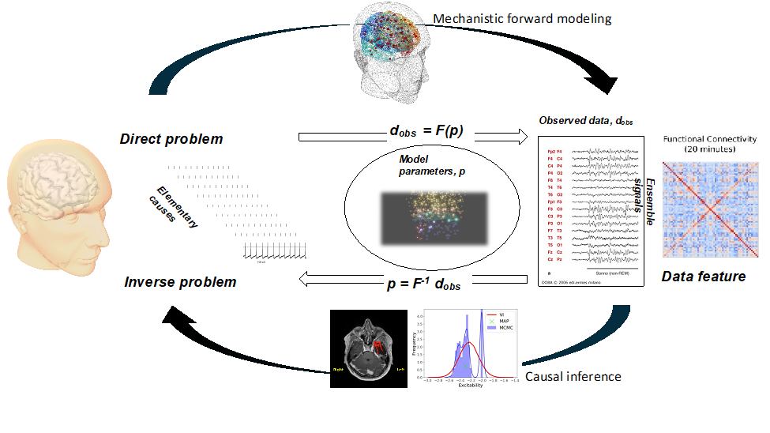

- #[[Viktor Jirsa]]
-
- ## 摘要
	- 神经科学的概念和理论植根于不同的领域，如信息论、动力系统理论和认知心理学。并非所有这些概念和理论都可以有机联系起来，一些概念之间无法直接进行比较，而领域内的特定术语对跨领域整合也造成了障碍。然而，概念层面的整合能够提供直觉和巩固的理解形式，对神经科学的进展形成重要的指导。
	  本文在信息理论框架内整合了确定性和随机性动力学过程，从而将信息熵和自由能与大脑网络中的涌现动力学和自组织机制联系起来。我们确定了导致网络中等变矩阵的神经元群体的基本属性，其复杂行为可以自然地通过流形上的结构化流来表示，从而建立大脑功能理论的内在模型。我们使用大脑网络模拟平台The Virtual Brain展示了如何将这些概念转化为实际应用，并通过健康老龄化和癫痫的例子说明了它的用途。
- **关键词**：虚拟大脑，脑网络，连接组，涌现，流形上的结构化流
- ## 1. 引言
	- 数据、工具和模型的整合与协作创造了科学价值，并最终加速科学进步。这一见解推动了自2010年以来大型团队中多尺度模型构建活动的发展（D'Angelo & Jirsa 2022; Amunts 等人 2022）。模型代表了我们在解剖学和生理学方面知识的形式化。 模型中的参数是与经验数据的联系，数据为模型参数提供了定量约束。然后，模型和数据的整合促进了因果推理，即通过量化模型和数据中的不确定性，从最初的前提和观察推进到逻辑结论的过程。因此，因果推理提供了决策有效性的客体化。它还产生了新的神经科学知识，这些知识是单单从数据中无法获得的，因为模型背景下的数据信息量更大。图 1 说明了这一科学过程背后的因果关系和推理循环，并已在 EBRAINS(https://ebrains.eu) 等大型数字神经科学研究基础设施中被视为发现的动力。 这种新颖的方法有助于解决神经科学进步的主要障碍，例如通过更好的机制可识别性（Vattikonda 等人 2021）。 重要的是，它有助于大脑模型的个体化，这对于转化为临床至关重要（Jirsa 等人，2016 年），并为在神经科学中使用数字孪生提供科学依据（D'Angelo & Jirsa 2022；Lu 等人，2022 年）。
	- 
		- **图1：因果-推理环。**大脑产生神经电活动，这取决于多种基础诱因（左），并且可以通过大脑成像（观察到的数据，右）进行访问。观察到的数据被分析并转化为数据特征，例如协方差（功能连接），它将数据中可用的信息压缩为度量。在理想情况下，该指标提供有关生成观察数据的基础诱因的信息。为了将观察结果与其原因联系起来，建立了机制模型，以数学形式表达我们对基础诱因的理解。模型参数 **p** 正式表征了机制，机制正向解 **F**（图上部）用于解释观测数据，**dobs=F(p)**，作为模型参数的函数。因果推理估计解释观测数据的机制的可能性，**p=F-1dobs**，从而通过后验概率分布（图的下部）估计不确定性。
	- 要成功使用图 1 中所示的因果-推理环，数据、模型和工具必须无缝整合且可互操作的。 这不仅仅是一个技术挑战。 科学工作流程还需要就实验范式和数据特征做出选择。 这些选择通常受大脑网络活动中行为如何表现或病理生理机制如何运作的理论驱动。 在下文中，我将介绍一些在使用 EBRAINS 中的因果-推理环时我认为相关的选择。 首先，我从流形结构化流(SFM) (Jirsa & Sheheitli 2022) 的角度来讨论行为与大脑活动的关系。SFM 提供了一个理论框架，根据神经系统中存在的对称性，解释了低维动力学如何在大脑网络中出现。 然后我讨论了 The Virtual Brain (TVB)，这是一个用于个体化全脑网络的脑网络模拟平台，可以生成 SFM。 随后，我展示了SFMS的数学细节，解释了基础理论，并强调了如何在实验脑成像数据中找到SFM。 最后，我提供了一些来自健康衰老和癫痫的静息状态领域的例子。
- ## 2. 论行为与脑活动的关联
	-